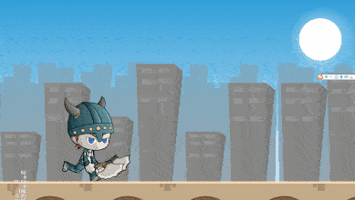
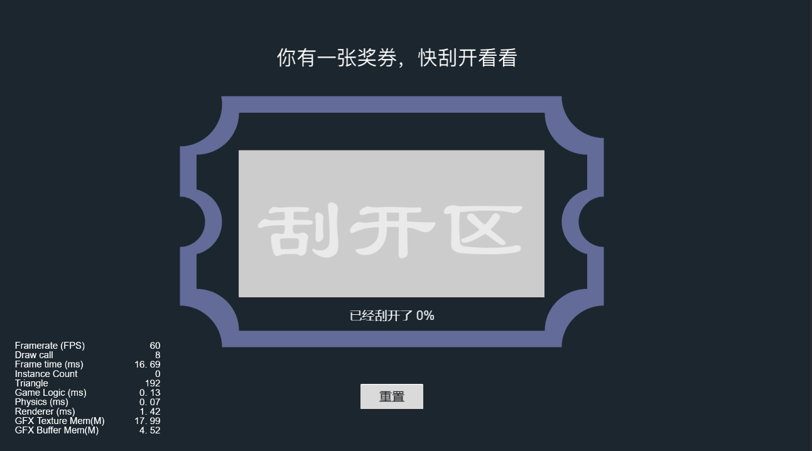
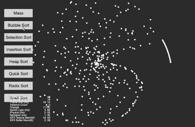

## CocosCreatorDemos
### Purpose
CocosCreatorDemos provides some user's needs DEMOs, hoping to provide users with some inspiration.
### Version
Cocos Creator v3.6.x

### 2D
| A1 | B1 | A2 | B2 | A3 | B3 |
| :---: | :--- | :---: | :--- | :---: | :--- |
| 1 | [UIMeshRenderer (Model)](#uimeshrenderermodel) | 2 | [UIMeshRenderer (Skeletal Animation)](#uimeshrendererskelanim) | 3 | [RenderTexture (Model)](#rendertexturemodel) |
| 4 | [RenderTexture (Skeletal Animation)](#rendertextureskelanim) | 5 | [Bullet Follow](#bulletfollow) | 6 | [KTV Label](#ktvlabel) |
| 7 | [Scrolling Background](#scrollingbackground) | 8 | [Virtual Joy Stick](#virtualjoystick) | 9 | [Screen Vibrating](#screenvibrating) |
| 10 | [Coin Fly To Wallet](#coinflytowallet) | 11 | [Scene Mini Map](#sceneminimap) | 12 | [Dual Split Screen](#dualsplitscreen) |
| 13 | [2D围绕物体旋转一周](#camerarotatearound2d) | 14 | [2D物体移动残影](#objectmovingshadow) | 15 | [2D物体移动残影(spine)](#objectmovingshadowspine) |
| 16 | [循环旋转菜单](#circularmenu) | 17 | [无限循环的翻页组件](#circlescrollview) | 18 | [打印机文字](#printerword) |
| 19 | [放大镜](#magnifier) | 20 | [刮刮卡](#scratchcard) | 21 | [可视化算法](#visualizationalgorithm) |
| 22 | [2D流体](#fluids2d) | 23 | [2D光照](#light2d) | 24 | [2D阴影](#shadowmap2d) |
| 25 | [GIF资源加载](#gifresourceloading) | 26 | [画板](#drawingboard) | 27 | [列表视图扩展](#listviewextension) |
| 28 | [自定义形状遮罩](#MaskPolygon) | 29 | [水面反射](#watersurfacereflection) | 30 | [等电梯](#waitingelevator) |
| 31 | [Spine局部换装](#spinechangeslotwithtexture) | 32 | [旋转循环页视图实现](#revolvepageview) | 33 | [图片切割](#spritesplit) |
| 34 | [Spine骨骼控制](#spinedragcontroller) | 35 | [音视频倍数播放](#mediaplaybackrate) | 36 | [TiledMap自动寻路](#tilemappathfinding) |
| 37 | [剪切板](#copyfile) | 38 | [卡片翻转](#cardflip) | 39 | [卡片阵列](#cardqueue) |
| 40 | [卡片阵列翻转](#cardflipandqueue) | 41 | [Graphics拓展和SVG加载](#raphael) | 42 | [旋转循环翻页视图](#rotatelooppageview) |
| 43 | [滚动抽奖](#lotteryrolling) | 44 | [从图集获取UV](#getuvfromtheatlas) | 45 | [RPG角色跟随](#getuvfromtheatlas) |
| 46 | [可视化算法(柱形图)](#visualizationalgorithm2) | 47 | [转向行为](#steeringbehavior) |

### 3D
| A1 | B1 | A2 | B2 | A3 | B3 |
| :---: | :--- | :---: | :--- | :---: | :--- |
| 1 | [3D围绕物体旋转一周(旋转摄像机)](#camerarotatearound3d) | 2 | [3D围绕物体旋转一周(四元数)](#camerarotatearound3dquat) | 3 | [3D文本](#modeltext) |
| 4 | [第一人称射击](#firstpersonshooting) | 5 | [第一人称视角](#firstpersonperspective) | 6 | [3D模型点击旋转](#modeltoucharound) |
| 7 | [3D围绕物体旋转(自转)](#selfrotatearound) | 8 | [模型换肤](#modeldressup) | 9 | [3D模型切割](#meshcutter) |
| 10 | [3D模型运动变速](#tweengametimescale) | 11 | [3D骨骼动画移动残影](#modelresidualshadows) | 12 | [动态替换Mesh](#dynamicmesh) |
| 13 | [模型查看器](#modelviewer) | 14 | [天空盒查看器](#skybox) | 15 | [闪电鞭](#lightningwhip) |
| 16 | [塞尔达](#cartoonvegetation) | 17 | [FPS第一人称射击](#fpsfirstperson) | 18 | [自定义布告板](#custombillboard) |
| 19 | [镜面效果](#mirroring) | 20 | [3D Label](#label3d) | 21 | [3D传送门](#portal3d) |

### 2D_Game
| A1 | B1 | A2 | B2 | A3 | B3 |
| :---: | :---: | :---: | :---: | :---: | :---: |
| 1 | [人生重启器](#liferestart) |

### 3D_Game
| A1 | B1 | A2 | B2 | A3 | B3 |
| :---: | :---: | :---: | :---: | :---: | :---: |
| 1 | [飞机大战](#airplane3d) | 2 | [快上车3D](#taxi3d) | 3 | [跑酷3D](#running3d) |
| 4 | [射击3D](#shooting3d) |

### UIMeshRendererModel
| 序号 | 标签 | 项目 | 编辑器版本 | 返回顶部 | 备注 |
| :--- | :---: | :---: | :---: | :---: | :---: |
| 1.1 | 2D | [UIMeshRenderer (Model)](https://github.com/yeshao2069/CocosCreatorDemos/tree/v3.6.x/demo/2d/Creator3.6.0_UIMeshRenderer) | 3.6.0 | [返回顶部](#2d) | 无 |

### UIMeshRendererSkelAnim
| 序号 | 标签 | 项目 | 编辑器版本 | 返回顶部 | 备注 |
| :--- | :---: | :---: | :---: | :---: | :---: |
| 1.2 | 2D | [UIMeshRenderer (Skeletal Animation)](https://github.com/yeshao2069/CocosCreatorDemos/tree/v3.6.x/demo/2d/Creator3.6.0_UIMeshRenderer_SkeletalAnim) | 3.6.0 | [返回顶部](#2d) | 无 |

### RenderTextureModel
| 序号 | 标签 | 项目 | 编辑器版本 | 返回顶部 | 备注 |
| :--- | :---: | :---: | :---: | :---: | :---: |
| 1.3 | 2D | [RenderTexture (Model)](https://github.com/yeshao2069/CocosCreatorDemos/tree/v3.6.x/demo/2d/Creator3.6.0_RenderTexture) | 3.6.0 | [返回顶部](#2d) | 无 |

### RenderTextureSkelAnim
| 序号 | 标签 | 项目 | 编辑器版本 | 返回顶部 | 备注 |
| :--- | :---: | :---: | :---: | :---: | :---: |
| 1.4 | 2D | [RenderTexture (Skeletal Animation)](https://github.com/yeshao2069/CocosCreatorDemos/tree/v3.6.x/demo/2d/Creator3.6.0_RenderTexture_SkeletalAnim) | 3.6.0 | [返回顶部](#2d) | 无 |

### BulletFollow
| 序号 | 标签 | 项目 | 编辑器版本 | 返回顶部 | 备注 |
| :--- | :---: | :---: | :---: | :---: | :---: |
| 1.5 | 2D | [Bullet Follow](https://github.com/yeshao2069/CocosCreatorDemos/tree/v3.6.x/demo/2d/Creator3.6.0_2D_BulletFollow) | 3.6.0 | [返回顶部](#2d) | 无 |

### KTVLabel
| 序号 | 标签 | 项目 | 编辑器版本 | 返回顶部 | 备注 |
| :--- | :---: | :---: | :---: | :---: | :---: |
| 1.6 | 2D | [KTV Label](https://github.com/yeshao2069/CocosCreatorDemos/tree/v3.6.x/demo/2d/Creator3.6.0_2D_KTVLabel) | 3.6.0 | [返回顶部](#2d) | 无 |

### ScrollingBackground
| 序号 | 标签 | 项目 | 编辑器版本 | 返回顶部 | 备注 |
| :--- | :---: | :---: | :---: | :---: | :---: |
| 1.7 | 2D | [Scrolling Background](https://github.com/yeshao2069/CocosCreatorDemos/tree/v3.6.x/demo/2d/Creator3.6.0_2D_ScrollingBackground) | 3.6.0 | [返回顶部](#2d) | 无 |

### VirtualJoyStick
| 序号 | 标签 | 项目 | 编辑器版本 | 返回顶部 | 备注 |
| :--- | :---: | :---: | :---: | :---: | :---: |
| 1.8 | 2D | [Virtual Joy Stick](https://github.com/yeshao2069/CocosCreatorDemos/tree/v3.6.x/demo/2d/Creator3.6.0_2D_VirtualJoyStick) | 3.6.0 | [返回顶部](#2d) | 无 |

### ScreenVibrating
| 序号 | 标签 | 项目 | 编辑器版本 | 返回顶部 | 备注 |
| :--- | :---: | :---: | :---: | :---: | :---: |
| 1.9 | 2D | [Screen Vibrating](https://github.com/yeshao2069/CocosCreatorDemos/tree/v3.6.x/demo/2d/Creator3.6.0_2D_ScreenVibrating) | 3.6.0 | [返回顶部](#2d) | 无 |

### CoinFlyToWallet
| 序号 | 标签 | 项目 | 编辑器版本 | 返回顶部 | 备注 |
| :--- | :---: | :---: | :---: | :---: | :---: |
| 1.10 | 2D | [Coin Fly To Wallet](https://github.com/yeshao2069/CocosCreatorDemos/tree/v3.6.x/demo/2d/Creator3.6.0_2D_CoinFlyToWallet) | 3.6.0 | [返回顶部](#2d) | 无 |

### SceneMiniMap
| 序号 | 标签 | 项目 | 编辑器版本 | 返回顶部 | 备注 |
| :--- | :---: | :---: | :---: | :---: | :---: |
| 1.11 | 2D | [Scene Mini Map](https://github.com/yeshao2069/CocosCreatorDemos/tree/v3.6.x/demo/2d/Creator3.6.0_2D_SceneMiniMap) | 3.6.0 | [返回顶部](#2d) | 无 |

### DualSplitScreen
| 序号 | 标签 | 项目 | 编辑器版本 | 返回顶部 | 备注 |
| :--- | :---: | :---: | :---: | :---: | :---: |
| 1.12 | 2D | [Dual Split Screen](https://github.com/yeshao2069/CocosCreatorDemos/tree/v3.6.x/demo/2d/Creator3.6.0_2D_DualSplitScreen) | 3.6.0 | [返回顶部](#2d) | 无 |

### CameraRotateAround2D
| 序号 | 标签 | 项目 | 编辑器版本 | 返回顶部 | 备注 |
| :--- | :---: | :---: | :---: | :---: | :---: |
| 1.13 | 2D | [2D围绕物体旋转一周](https://github.com/yeshao2069/CocosCreatorDemos/tree/v3.6.x/demo/2d/Creator3.6.0_2D_CameraRotateAround) | 3.6.0 | [返回顶部](#2d) | 无 |

### ObjectMovingShadow
| 序号 | 标签 | 项目 | 编辑器版本 | 返回顶部 | 备注 |
| :--- | :---: | :---: | :---: | :---: | :---: |
| 1.14 | 2D | [2D物体移动残影](https://github.com/yeshao2069/CocosCreatorDemos/tree/v3.6.x/demo/2d/Creator3.6.0_2D_ObjectMovingShadow) | 3.6.0 | [返回顶部](#2d) | 无 |

### ObjectMovingShadowSpine
| 序号 | 标签 | 项目 | 编辑器版本 | 返回顶部 | 备注 |
| :--- | :---: | :---: | :---: | :---: | :---: |
| 1.15 | 2D | [2D物体移动残影(spine)](https://github.com/yeshao2069/CocosCreatorDemos/tree/v3.6.x/demo/2d/Creator3.6.0_2D_ObjectMovingShadow_Spine) | 3.6.0 | [返回顶部](#2d) | 无 |

### CircularMenu
| 序号 | 标签 | 项目 | 编辑器版本 | 返回顶部 | 备注 |
| :--- | :---: | :---: | :---: | :---: | :---: |
| 1.16 | 2D | [循环旋转菜单](https://github.com/yeshao2069/CocosCreatorDemos/tree/v3.6.x/demo/2d/Creator3.6.0_2D_CircularMenu) | 3.6.0 | [返回顶部](#2d) | 无 |

### CircleScrollview
| 序号 | 标签 | 项目 | 编辑器版本 | 返回顶部 | 备注 |
| :--- | :---: | :---: | :---: | :---: | :---: |
| 1.17 | 2D | [无限循环的翻页组件](https://github.com/yeshao2069/CocosCreatorDemos/tree/v3.6.x/demo/2d/Creator3.6.1_2D_CircleScrollview) | 3.6.1 | [返回顶部](#2d) | 无 |

### PrinterWord
| 序号 | 标签 | 项目 | 编辑器版本 | 返回顶部 | 备注 |
| :--- | :---: | :---: | :---: | :---: | :---: |
| 1.18 | 2D | [打印机文字](https://github.com/yeshao2069/CocosCreatorDemos/tree/v3.6.x/demo/2d/Creator3.6.0_2D_PrinterWord) | 3.6.0 | [返回顶部](#2d) | 无 |

### Magnifier
| 序号 | 标签 | 项目 | 编辑器版本 | 返回顶部 | 备注 |
| :--- | :---: | :---: | :---: | :---: | :---: |
| 1.19 | 2D | [放大镜](https://github.com/yeshao2069/CocosCreatorDemos/tree/v3.6.x/demo/2d/Creator3.6.0_2D_Magnifier) | 3.6.0 | [返回顶部](#2d) | 无 |

### ScratchCard
| 序号 | 标签 | 项目 | 编辑器版本 | 返回顶部 | 备注 |
| :--- | :---: | :---: | :---: | :---: | :---: |
| 1.20 | 2D | [刮刮卡](https://github.com/yeshao2069/CocosCreatorDemos/tree/v3.6.x/demo/2d/Creator3.6.0_2D_ScratchCard) | 3.6.0 | [返回顶部](#2d) | 无 |

### VisualizationAlgorithm
| 序号 | 标签 | 项目 | 编辑器版本 | 返回顶部 | 备注 |
| :--- | :---: | :---: | :---: | :---: | :---: |
| 1.21 | 2D | [可视化算法](https://github.com/yeshao2069/CocosCreatorDemos/tree/v3.6.x/demo/2d/Creator3.6.0_2D_VisualizationAlgorithm) | 3.6.0 | [返回顶部](#2d) | 无 |

### Fluids2D
| 序号 | 标签 | 项目 | 编辑器版本 | 返回顶部 | 备注 |
| :--- | :---: | :---: | :---: | :---: | :---: |
| 1.22 | 2D | [2D流体](https://github.com/yeshao2069/CocosCreatorDemos/tree/v3.6.x/demo/2d/Creator3.6.0_2D_Fluids) | [返回顶部](#2d) | 无 |

### Light2D
| 序号 | 标签 | 项目 | 编辑器版本 | 返回顶部 | 备注 |
| :--- | :---: | :---: | :---: | :---: | :---: |
| 1.23 | 2D | [2D光照](https://github.com/yeshao2069/CocosCreatorDemos/tree/v3.6.x/demo/2d/Creator3.6.1_2D_Light) | 3.6.1 | [返回顶部](#2d) | 无 |

### ShadowMap2D
| 序号 | 标签 | 项目 | 编辑器版本 | 返回顶部 | 备注 |
| :--- | :---: | :---: | :---: | :---: | :---: |
| 1.24 | 2D | [2D阴影](https://github.com/yeshao2069/CocosCreatorDemos/tree/v3.6.x/demo/2d/Creator3.6.0_2D_ShadowMap) | 3.6.0 | [返回顶部](#2d) | 无 |

### GifResourceLoading
| 序号 | 标签 | 项目 | 编辑器版本 | 返回顶部 | 备注 |
| :--- | :---: | :---: | :---: | :---: | :---: |
| 1.25 | 2D | [GIF资源加载](https://github.com/yeshao2069/CocosCreatorDemos/tree/v3.6.x/demo/2d/Creator3.6.0_2D_GifResourceLoading) | 3.6.0 | [返回顶部](#2d) | 无 |

### DrawingBoard
| 序号 | 标签 | 项目 | 编辑器版本 | 返回顶部 | 备注 |
| :--- | :---: | :---: | :---: | :---: | :---: |
| 1.26 | 2D | [画板](https://github.com/yeshao2069/CocosCreatorDemos/tree/v3.6.x/demo/2d/Creator3.6.0_2D_DrawingBoard) | 3.6.0 | [返回顶部](#2d) | 无 |

### ListViewExtension
| 序号 | 标签 | 项目 | 编辑器版本 | 返回顶部 | 备注 |
| :--- | :---: | :---: | :---: | :---: | :---: |
| 1.27 | 2D | [列表视图扩展](https://github.com/yeshao2069/CocosCreatorDemos/tree/v3.6.x/demo/2d/Creator3.6.0_2D_ListViewExtension) | 3.6.0 | [返回顶部](#2d) | 无 |

### MaskPolygon
| 序号 | 标签 | 项目 | 编辑器版本 | 返回顶部 | 备注 |
| :--- | :---: | :---: | :---: | :---: | :---: |
| 1.28 | 2D | [自定义形状遮罩](https://github.com/yeshao2069/CocosCreatorDemos/tree/v3.6.x/demo/2d/Creator3.6.0_2D_Mask_Polygon) | 3.6.0 | [返回顶部](#2d) | 无 |

### WaterSurfaceReflection
| 序号 | 标签 | 项目 | 编辑器版本 | 返回顶部 | 备注 |
| :--- | :---: | :---: | :---: | :---: | :---: |
| 1.29 | 2D | [水面反射](https://github.com/yeshao2069/CocosCreatorDemos/tree/v3.6.x/demo/2d/Creator3.6.0_2D_WaterSurfaceReflection) | 3.6.0 | [返回顶部](#2d) | 无 |

### WaitingElevator
| 序号 | 标签 | 项目 | 编辑器版本 | 返回顶部 | 备注 |
| :--- | :---: | :---: | :---: | :---: | :---: |
| 1.30 | 2D | [等电梯](https://github.com/yeshao2069/CocosCreatorDemos/tree/v3.6.x/demo/2d/Creator3.6.0_2D_WaitingElevator) | 3.6.0 | [返回顶部](#2d) | 无 |

### CameraRotateAround3D
| 序号 | 标签 | 项目 | 编辑器版本 | 返回顶部 | 备注 |
| :--- | :---: | :---: | :---: | :---: | :---: |
| 2.1 | 3D | [3D围绕物体旋转一周(旋转摄像机)](https://github.com/yeshao2069/CocosCreatorDemos/tree/v3.6.x/demo/3d/Creator3.6.0_3D_CameraRotateAround) | 3.6.0 | [返回顶部](#3d) | 无 |

### CameraRotateAround3DQuat
| 序号 | 标签 | 项目 | 编辑器版本 | 返回顶部 | 备注 |
| :--- | :---: | :---: | :---: | :---: | :---: |
| 2.2 | 3D | [3D围绕物体旋转一周(四元数)](https://github.com/yeshao2069/CocosCreatorDemos/tree/v3.6.x/demo/3d/Creator3.6.0_3D_CameraRotateAround_Quat) | 3.6.0 | [返回顶部](#3d) | 无 |

### ModelText
| 序号 | 标签 | 项目 | 编辑器版本 | 返回顶部 | 备注 |
| :--- | :---: | :---: | :---: | :---: | :---: |
| 2.3 | 3D | [3D文本](https://github.com/yeshao2069/CocosCreatorDemos/tree/v3.6.x/demo/3d/Creator3.6.0_3D_ModelText) | 3.6.0 | [返回顶部](#3d) | 无 |

### FirstPersonShooting
| 序号 | 标签 | 项目 | 编辑器版本 | 返回顶部 | 备注 |
| :--- | :---: | :---: | :---: | :---: | :---: |
| 2.4 | 3D | [第一人称射击](https://github.com/yeshao2069/CocosCreatorDemos/tree/v3.6.x/demo/3d/Creator3.6.0_3D_FirstPersonShooting) | 3.6.0 | [返回顶部](#3d) | 无 |

### FirstPersonPerspective
| 序号 | 标签 | 项目 | 编辑器版本 | 返回顶部 | 备注 |
| :--- | :---: | :---: | :---: | :---: | :---: |
| 2.5 | 3D | [第一人称视角](https://github.com/yeshao2069/CocosCreatorDemos/tree/v3.6.x/demo/3d/Creator3.6.0_3D_FirstPersonPerspective) | 3.6.0 | [返回顶部](#3d) | 无 |

### ModelTouchAround
| 序号 | 标签 | 项目 | 编辑器版本 | 返回顶部 | 备注 |
| :--- | :---: | :---: | :---: | :---: | :---: |
| 2.6 | 3D | [3D模型点击旋转](https://github.com/yeshao2069/CocosCreatorDemos/tree/v3.6.x/demo/3d/Creator3.6.0_3D_ModelTouchAround) | 3.6.0 | [返回顶部](#3d) | 无 |

### SelfRotateAround
| 序号 | 标签 | 项目 | 编辑器版本 | 返回顶部 | 备注 |
| :--- | :---: | :---: | :---: | :---: | :---: |
| 2.7 | 3D | [3D围绕物体旋转(自转)](https://github.com/yeshao2069/CocosCreatorDemos/tree/v3.6.x/demo/3d/Creator3.6.0_3D_SelfRotateAround) | 3.6.0 | [返回顶部](#3d) | 无 |

### ModelDressup
| 序号 | 标签 | 项目 | 编辑器版本 | 返回顶部 | 备注 |
| :--- | :---: | :---: | :---: | :---: | :---: |
| 2.8 | 3D | [模型换肤](https://github.com/yeshao2069/CocosCreatorDemos/tree/v3.6.x/demo/3d/Creator3.6.0_3D_ModelDressup) | 3.6.0 | [返回顶部](#3d) | 无 |

### MeshCutter
| 序号 | 标签 | 项目 | 编辑器版本 | 返回顶部 | 备注 |
| :--- | :---: | :---: | :---: | :---: | :---: |
| 2.9 | 3D | [3D模型切割](https://github.com/yeshao2069/CocosCreatorDemos/tree/v3.6.x/demo/3d/Creator3.6.0_3D_MeshCutter) | 3.6.0 | [返回顶部](#3d) | 无 |

### TweenGameTimeScale
| 序号 | 标签 | 项目 | 编辑器版本 | 返回顶部 | 备注 |
| :--- | :---: | :---: | :---: | :---: | :---: |
| 2.10 | 3D | [3D模型运动变速](https://github.com/yeshao2069/CocosCreatorDemos/tree/v3.6.x/demo/3d/Creator3.6.0_3D_TweenGameTimeScale) | 3.6.0 | [返回顶部](#3d) | 无 |

### ModelResidualShadows
| 序号 | 标签 | 项目 | 编辑器版本 | 返回顶部 | 备注 |
| :--- | :---: | :---: | :---: | :---: | :---: |
| 2.11 | 3D | [3D骨骼动画移动残影](https://github.com/yeshao2069/CocosCreatorDemos/tree/v3.6.x/demo/3d/Creator3.6.0_3D_ModelResidualShadows) | 3.6.0 | [返回顶部](#3d) | 无 |

### DynamicMesh
| 序号 | 标签 | 项目 | 编辑器版本 | 返回顶部 | 备注 |
| :--- | :---: | :---: | :---: | :---: | :---: |
| 2.12 | 3D | [动态替换Mesh](https://github.com/yeshao2069/CocosCreatorDemos/tree/v3.6.x/demo/3d/Creator3.6.0_3D_DynamicMesh) | 3.6.0 | [返回顶部](#3d) | 无 |

### ModelViewer
| 序号 | 标签 | 项目 | 编辑器版本 | 返回顶部 | 备注 |
| :--- | :---: | :---: | :---: | :---: | :---: |
| 2.13 | 3D | [模型查看器](https://github.com/yeshao2069/CocosCreatorDemos/tree/v3.6.x/demo/3d/Creator3.6.0_3D_ModelViewer) | 3.6.0 | [返回顶部](#3d) | 无 |

### Skybox
| 序号 | 标签 | 项目 | 编辑器版本 | 返回顶部 | 备注 |
| :--- | :---: | :---: | :---: | :---: | :---: |
| 2.14 | 3D | [天空盒查看器](https://github.com/yeshao2069/CocosCreatorDemos/tree/v3.6.x/demo/3d/Creator3.6.0_3D_Skybox) | 3.6.0 | [返回顶部](#3d) | 无 |

### LightningWhip
| 序号 | 标签 | 项目 | 编辑器版本 | 返回顶部 | 备注 |
| :--- | :---: | :---: | :---: | :---: | :---: |
| 2.15 | 3D | [闪电鞭](https://github.com/yeshao2069/CocosCreatorDemos/tree/v3.6.x/demo/3d/Creator3.6.0_3D_LightningWhip) | 3.6.0 | [返回顶部](#3d) | 无 |

### CartoonVegetation
| 序号 | 标签 | 项目 | 编辑器版本 | 返回顶部 | 备注 |
| :--- | :---: | :---: | :---: | :---: | :---: |
| 2.16 | 3D | [塞尔达](https://github.com/yeshao2069/CocosCreatorDemos/tree/v3.6.x/demo/3d/Creator3.6.0_3D_CartoonVegetation) | 3.6.0 | [返回顶部](#3d) | 无 |

### FPSFirstPerson
| 序号 | 标签 | 项目 | 编辑器版本 | 返回顶部 | 备注 |
| :--- | :---: | :---: | :---: | :---: | :---: |
| 2.17 | 3D | [FPS第一人称射击](https://github.com/yeshao2069/CocosCreatorDemos/tree/v3.6.x/demo/3d/Creator3.6.0_3D_FPS_FirstPerson) | 3.6.0 | [返回顶部](#3d) | 无 |

### CustomBillboard
| 序号 | 标签 | 项目 | 编辑器版本 | 返回顶部 | 备注 |
| :--- | :---: | :---: | :---: | :---: | :---: |
| 2.18 | 3D | [自定义布告板](https://github.com/yeshao2069/CocosCreatorDemos/tree/v3.6.x/demo/3d/Creator3.6.1_3D_CustomBillboard) | 3.6.1 | [返回顶部](#3d) | 无 |

### Mirroring
| 序号 | 标签 | 项目 | 编辑器版本 | 返回顶部 | 备注 |
| :--- | :---: | :---: | :---: | :---: | :---: |
| 2.19 | 3D | [镜面效果](https://github.com/yeshao2069/CocosCreatorDemos/tree/v3.6.x/demo/3d/Creator3.6.0_3D_Mirroring) | 3.6.0 | [返回顶部](#3d) | 无 |

### Label3D
| 序号 | 标签 | 项目 | 编辑器版本 | 返回顶部 | 备注 |
| :--- | :---: | :---: | :---: | :---: | :---: |
| 2.20 | 3D | [3D Label](https://github.com/yeshao2069/CocosCreatorDemos/tree/v3.6.x/demo/3d/Creator3.6.1_3D_Label3D) | 3.6.1 | [返回顶部](#3d) | 无 |

### Portal3D
| 序号 | 标签 | 项目 | 编辑器版本 | 返回顶部 | 备注 |
| :--- | :---: | :---: | :---: | :---: | :---: |
| 2.21 | 3D | [3D传送门](https://github.com/yeshao2069/CocosCreatorDemos/tree/v3.6.x/demo/3d/Creator3.6.2_3D_Portal) | 3.6.2 | [返回顶部](#3d) | 无 |

### SpineChangeSlotWithTexture
| 序号 | 标签 | 项目 | 编辑器版本 | 返回顶部 | 备注 |
| :--- | :---: | :---: | :---: | :---: | :---: |
| 3.1 | 2D | [Spine局部换装](https://github.com/yeshao2069/CocosCreatorDemos/tree/v3.6.x/demo/2dP1/Creator3.6.0_2D_SpineChangeSlotWithTexture) | 3.6.0 | [返回顶部](#2d) | 无 |

### RevolvePageView
| 序号 | 标签 | 项目 | 编辑器版本 | 返回顶部 | 备注 |
| :--- | :---: | :---: | :---: | :---: | :---: |
| 3.2 | 2D | [旋转循环页视图实现](https://github.com/yeshao2069/CocosCreatorDemos/tree/v3.6.x/demo/2dP1/Creator3.6.0_2D_RevolvePageView) | 3.6.0 | [返回顶部](#2d) | 无 |

### SpriteSplit
| 序号 | 标签 | 项目 | 编辑器版本 | 返回顶部 | 备注 |
| :--- | :---: | :---: | :---: | :---: | :---: |
| 3.3 | 2D | [图片切割](https://github.com/yeshao2069/CocosCreatorDemos/tree/v3.6.x/demo/2dP1/Creator3.6.0_2D_SpriteSplit) | 3.6.0 | [返回顶部](#2d) | 无 |

### SpineDragController
| 序号 | 标签 | 项目 | 编辑器版本 | 返回顶部 | 备注 |
| :--- | :---: | :---: | :---: | :---: | :---: |
| 3.4 | 2D | [Spine骨骼控制](https://github.com/yeshao2069/CocosCreatorDemos/tree/v3.6.x/demo/2dP1/Creator3.6.0_2D_SpineDragController) | 3.6.0 | [返回顶部](#2d) | 无 |

### MediaPlaybackRate
| 序号 | 标签 | 项目 | 编辑器版本 | 返回顶部 | 备注 |
| :--- | :---: | :---: | :---: | :---: | :---: |
| 3.5 | 2D | [音视频倍数播放](https://github.com/yeshao2069/CocosCreatorDemos/tree/v3.6.x/demo/2dP1/Creator3.6.0_MediaPlaybackRate) | 3.6.0 | [返回顶部](#2d) | 无 |

  

### TileMapPathFinding
| 序号 | 标签 | 项目 | 编辑器版本 | 返回顶部 | 备注 |
| :--- | :---: | :---: | :---: | :---: | :---: |
| 3.6 | 2D | [TiledMap自动寻路](https://github.com/yeshao2069/CocosCreatorDemos/tree/v3.6.x/demo/2dP1/Creator3.6.0_2D_TileMap_PathFinding) | 3.6.0 | [返回顶部](#2d) | 无 |

### CopyFile
| 序号 | 标签 | 项目 | 编辑器版本 | 返回顶部 | 备注 |
| :--- | :---: | :---: | :---: | :---: | :---: |
| 3.7 | 2D | [剪切板](https://github.com/yeshao2069/CocosCreatorDemos/tree/v3.6.x/demo/2dP1/Creator3.6.0_CopyFile) | 3.6.0 | [返回顶部](#2d) | 无 |

### CardFlip
| 序号 | 标签 | 项目 | 编辑器版本 | 返回顶部 | 备注 |
| :--- | :---: | :---: | :---: | :---: | :---: |
| 3.8 | 2D | [卡片翻转](https://github.com/yeshao2069/CocosCreatorDemos/tree/v3.6.x/demo/2dP1/Creator3.6.0_2D_CardFlip) | 3.6.0 | [返回顶部](#2d) | 无 |

### CardQueue
| 序号 | 标签 | 项目 | 编辑器版本 | 返回顶部 | 备注 |
| :--- | :---: | :---: | :---: | :---: | :---: |
| 3.9 | 2D | [卡片阵列](https://github.com/yeshao2069/CocosCreatorDemos/tree/v3.6.x/demo/2dP1/Creator3.6.0_2D_CardQueue) | 3.6.0 | [返回顶部](#2d) | 无 |

### CardFlipAndQueue
| 序号 | 标签 | 项目 | 编辑器版本 | 返回顶部 | 备注 |
| :--- | :---: | :---: | :---: | :---: | :---: |
| 3.10 | 2D | [卡片阵列翻转](https://github.com/yeshao2069/CocosCreatorDemos/tree/v3.6.x/demo/2dP1/Creator3.6.0_2D_CardFlipAndQueue) | 3.6.0 | [返回顶部](#2d) | 无 |

### Raphael
| 序号 | 标签 | 项目 | 编辑器版本 | 返回顶部 | 备注 |
| :--- | :---: | :---: | :---: | :---: | :---: |
| 3.11 | 2D | [Graphics拓展和SVG加载](https://github.com/yeshao2069/CocosCreatorDemos/tree/v3.6.x/demo/2dP1/Creator3.6.0_2D_Raphael) | 3.6.0 | [返回顶部](#2d) | 无 |

### RotateLoopPageView
| 序号 | 标签 | 项目 | 编辑器版本 | 返回顶部 | 备注 |
| :--- | :---: | :---: | :---: | :---: | :---: |
| 3.12 | 2D | [旋转循环翻页视图](https://github.com/yeshao2069/CocosCreatorDemos/tree/v3.6.x/demo/2dP1/Creator3.6.1_2D_RotateLoopPageView) | 3.6.1 | [返回顶部](#2d) | 无 |

### LotteryRolling
| 序号 | 标签 | 项目 | 编辑器版本 | 返回顶部 | 备注 |
| :--- | :---: | :---: | :---: | :---: | :---: |
| 3.13 | 2D | [滚动抽奖](https://github.com/yeshao2069/CocosCreatorDemos/tree/v3.6.x/demo/2dP1/Creator3.6.1_2D_LotteryRolling) | 3.6.1 | [返回顶部](#2d) | 无 |

### GetUVFromTheAtlas
| 序号 | 标签 | 项目 | 编辑器版本 | 返回顶部 | 备注 |
| :--- | :---: | :---: | :---: | :---: | :---: |
| 3.14 | 2D | [从图集获取UV](https://github.com/yeshao2069/CocosCreatorDemos/tree/v3.6.x/demo/2dP1/Creator3.6.1_2D_GetUVFromTheAtlas) | 3.6.1 | [返回顶部](#2d) | 无 |

### RoleFollow
| 序号 | 标签 | 项目 | 编辑器版本 | 返回顶部 | 备注 |
| :--- | :---: | :---: | :---: | :---: | :---: |
| 3.15 | 2D | [RPG角色跟随](https://github.com/yeshao2069/CocosCreatorDemos/tree/v3.6.x/demo/2dP1/Creator3.6.2_2D_RoleFollow) | 3.6.2 | [返回顶部](#2d) | 无 |

### VisualizationAlgorithm2
| 序号 | 标签 | 项目 | 编辑器版本 | 返回顶部 | 备注 |
| :--- | :---: | :---: | :---: | :---: | :---: |
| 3.16 | 2D | [可视化算法(柱形图)](https://github.com/yeshao2069/CocosCreatorDemos/tree/v3.6.x/demo/2dP1/Creator3.6.2_2D_VisualizationAlgorithm2) | 3.6.2 | [返回顶部](#2d) | 无 |

### SteeringBehavior
| 序号 | 标签 | 项目 | 编辑器版本 | 返回顶部 | 备注 |
| :--- | :---: | :---: | :---: | :---: | :---: |
| 3.17 | 2D | [转向行为](https://github.com/yeshao2069/CocosCreatorDemos/tree/v3.6.x/demo/2dP1/Creator3.6.2_2D_SteeringBehavior) | 3.6.2 | [返回顶部](#2d) | 无 |

### LifeRestart
| 序号 | 标签 | 项目 | 编辑器版本 | 返回顶部 | 备注 |
| :--- | :---: | :---: | :---: | :---: | :---: |
| 4.1 | 2D | [人生重启器](https://github.com/yeshao2069/CocosCreatorDemos/tree/v3.6.x/game/2d/Creator3.6.0_3D_Airplane) | 3.6.0 | [返回顶部](#2d_game) | 无 |

### Airplane3D
| 序号 | 标签 | 项目 | 编辑器版本 | 返回顶部 | 备注 |
| :--- | :---: | :---: | :---: | :---: | :---: |
| 5.1 | 3D | [飞机大战](https://github.com/yeshao2069/CocosCreatorDemos/tree/v3.6.x/game/3d/Creator3.6.0_3D_Airplane) | 3.6.0 | [返回顶部](#3d_game) | 无 |

### Taxi3D
| 序号 | 标签 | 项目 | 编辑器版本 | 返回顶部 | 备注 |
| :--- | :---: | :---: | :---: | :---: | :---: |
| 5.2 | 3D | [快上车3D](https://github.com/yeshao2069/CocosCreatorDemos/tree/v3.6.x/game/3d/Creator3.6.0_3D_Taxi) | 3.6.0 | [返回顶部](#3d_game) | 无 |

### Running3D
| 序号 | 标签 | 项目 | 编辑器版本 | 返回顶部 | 备注 |
| :--- | :---: | :---: | :---: | :---: | :---: |
| 5.3 | 3D | [跑酷3D](https://github.com/yeshao2069/CocosCreatorDemos/tree/v3.6.x/game/3d/Creator3.6.0_3D_Running) | 3.6.0 | [返回顶部](#3d_game) | 无 |

### Shooting3D
| 序号 | 标签 | 项目 | 编辑器版本 | 返回顶部 | 备注 |
| :--- | :---: | :---: | :---: | :---: | :---: |
| 5.4 | 3D | [射击3D](https://github.com/yeshao2069/CocosCreatorDemos/tree/v3.6.x/game/3d/Creator3.6.0_3D_Shooting) | 3.6.0 | [返回顶部](#3d_game) | 无 |

