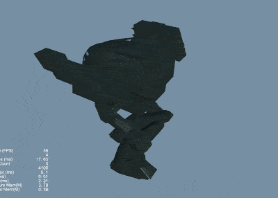
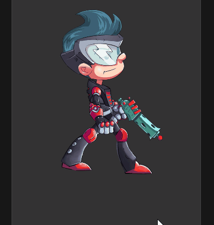

## CocosCreatorDemos
### Purpose
CocosCreatorDemos provides some user's needs DEMOs, hoping to provide users with some inspiration.
### Version
Cocos Creator v3.5.x

### 2D
| A1 | B1 | A2 | B2 | A3 | B3 |
| :---: | :---: | :---: | :---: | :---: | :---: |
| 1 | [3D模型显示在UI中(UIMeshRenderer)](#uimeshrenderermodel) | 2 | [骨骼动画显示在UI中(UIMeshRenderer)](#uimeshrendererskelanim) | 3 | [3D模型显示在UI中(RenderTexture)](#rendertexturemodel) |
| 4 | [骨骼动画显示在UI中(RenderTexture)](#rendertextureskelanim) | 5 | [物体追踪](#bulletfollow) | 6 | [KTV歌词](#ktvlabel) |
| 7 | [无限视差滚动背景](#scrollingbackground) | 8 | [虚拟摇杆](#virtualjoystick) | 9 | [屏幕点击震动](#screenvibrating) |
| 10 | [金币落袋](#coinflytowallet) | 11 | [场景小地图](#sceneminimap) | 12 | [双人同屏](#dualsplitscreen) |
| 13 | [2D围绕物体旋转一周](#camerarotatearound2d) | 14 | [2D物体移动残影](#objectmovingshadow) | 15 | [2D物体移动残影(spine)](#objectmovingshadowspine) |
| 16 | [循环旋转菜单](#circularmenu) | 17 | [无限循环的翻页组件](#circlescrollview) | 18 | [打印机文字](#printerword) |
| 19 | [放大镜](#magnifier) | 20 | [刮刮卡](#scratchcard) | 21 | [可视化算法](#visualizationalgorithm) |
| 22 | [2D流体](#fluids2d) | 23 | [2D光照](#light2d) | 24 | [2D阴影](#shadowmap2d) |
| 25 | [龙骨动画指定帧播放](#dragonbonesspecifiedframe) | 26 | [Spine动画指定帧播放](#spinespecifiedframe) | 27 | [GIF资源加载](#gifresourceloading) |
| 28 | [画板](#drawingboard) | 29 | [列表视图扩展](#listviewextension) | 30 | [自定义形状遮罩](#MaskPolygon) |
| 31 | [Spine局部换装](#spinechangeslotwithtexture) | 32 | [旋转循环页视图实现](#revolvepageview) | 33 | [图片切割](#spritesplit) |
| 34 | [Spine骨骼控制](#spinedragcontroller) | 35 | [音视频倍数播放](#mediaplaybackrate) | 36 | [TiledMap自动寻路](#tilemappathfinding) |
| 37 | [剪切板](#copyfile) | 38 | [卡片翻转](#cardflip) | 39 | [卡片阵列](#cardqueue) |
| 40 | [卡片阵列翻转](#cardflipandqueue) |

### 3D
| A1 | B1 | A2 | B2 | A3 | B3 |
| :---: | :---: | :---: | :---: | :---: | :---: |
| 1 | [3D围绕物体旋转一周(旋转摄像机)](#camerarotatearound3d) | 2 | [3D围绕物体旋转一周(四元数)](#camerarotatearound3dquat) | 3 | [3D文本](#modeltext) |
| 4 | [第一人称射击](#firstpersonshooting) | 5 | [第一人称视角](#firstpersonperspective) | 6 | [3D模型点击旋转](#modeltoucharound) |
| 7 | [3D围绕物体旋转(自转)](#selfrotatearound) | 8 | [模型换肤](#modeldressup) | 9 | [骨骼动画指定帧播放](#skeletalanimationspecifiedframe) |
| 10 | [3D模型切割](#meshcutter) | 11 | [3D模型运动变速](#tweengametimescale) | 12 | [3D骨骼动画移动残影](#modelresidualshadows) |
| 13 | [3D模型拖尾](#rolemotionvertex) | 14 | [模型贴花](#graffiti3d) | 15 | [雨滴滑落](#raindrop) |
| 16 | [动态替换Mesh](#dynamicmesh) | 17 | [辉光](#modelbloom) | 18 | [模型查看器](#modelviewer) |
| 19 | [模型边缘光](#modelrimlight) | 20 | [天空盒查看器](#skybox) | 21 | [武器发光](#weaponglow) |
| 22 | [闪电鞭](#lightningwhip) |

### UIMeshRendererModel
| 序号 | 标签 | 项目 | 编辑器版本 | 返回顶部 | 备注 |
| :--- | :---: | :---: | :---: | :---: | :---: |
| 1.1 | 2D | [3D模型显示在UI中(UIMeshRenderer)](https://gitee.com/yeshao2069/CocosCreatorDemos/tree/v3.5.x/demo/2d/Creator3.5.0_UIMeshRenderer) | 3.5.0 | [返回顶部](#2d) | 无 |

### UIMeshRendererSkelAnim
| 序号 | 标签 | 项目 | 编辑器版本 | 返回顶部 | 备注 |
| :--- | :---: | :---: | :---: | :---: | :---: |
| 1.2 | 2D | [骨骼动画显示在UI中(UIMeshRenderer)](https://gitee.com/yeshao2069/CocosCreatorDemos/tree/v3.5.x/demo/2d/Creator3.5.0_UIMeshRenderer_SkeletalAnim) | 3.5.0 | [返回顶部](#2d) | 无 |

### RenderTextureModel
| 序号 | 标签 | 项目 | 编辑器版本 | 返回顶部 | 备注 |
| :--- | :---: | :---: | :---: | :---: | :---: |
| 1.3 | 2D | [3D模型显示在UI中(RenderTexture)](https://gitee.com/yeshao2069/CocosCreatorDemos/tree/v3.5.x/demo/2d/Creator3.5.0_RenderTexture) | 3.5.0 | [返回顶部](#2d) | 无 |

### RenderTextureSkelAnim
| 序号 | 标签 | 项目 | 编辑器版本 | 返回顶部 | 备注 |
| :--- | :---: | :---: | :---: | :---: | :---: |
| 1.4 | 2D | [骨骼动画显示在UI中(RenderTexture)](https://gitee.com/yeshao2069/CocosCreatorDemos/tree/v3.5.x/demo/2d/Creator3.5.0_RenderTexture_SkeletalAnim) | 3.5.0 | [返回顶部](#2d) | 无 |

### BulletFollow
| 序号 | 标签 | 项目 | 编辑器版本 | 返回顶部 | 备注 |
| :--- | :---: | :---: | :---: | :---: | :---: |
| 1.5 | 2D | [物体追踪](https://gitee.com/yeshao2069/CocosCreatorDemos/tree/v3.5.x/demo/2d/Creator3.5.0_2D_BulletFollow) | 3.5.0 | [返回顶部](#2d) | 无 |

### KTVLabel
| 序号 | 标签 | 项目 | 编辑器版本 | 返回顶部 | 备注 |
| :--- | :---: | :---: | :---: | :---: | :---: |
| 1.6 | 2D | [KTV歌词](https://gitee.com/yeshao2069/CocosCreatorDemos/tree/v3.5.x/demo/2d/Creator3.5.0_2D_KTVLabel) | 3.5.0 | [返回顶部](#2d) | 无 |

### ScrollingBackground
| 序号 | 标签 | 项目 | 编辑器版本 | 返回顶部 | 备注 |
| :--- | :---: | :---: | :---: | :---: | :---: |
| 1.7 | 2D | [无限视差滚动背景](https://gitee.com/yeshao2069/CocosCreatorDemos/tree/v3.5.x/demo/2d/Creator3.5.0_2D_ScrollingBackground) | 3.5.0 | [返回顶部](#2d) | 无 |

### VirtualJoyStick
| 序号 | 标签 | 项目 | 编辑器版本 | 返回顶部 | 备注 |
| :--- | :---: | :---: | :---: | :---: | :---: |
| 1.8 | 2D | [虚拟摇杆](https://gitee.com/yeshao2069/CocosCreatorDemos/tree/v3.5.x/demo/2d/Creator3.5.0_2D_VirtualJoyStick) | 3.5.0 | [返回顶部](#2d) | 无 |

### ScreenVibrating
| 序号 | 标签 | 项目 | 编辑器版本 | 返回顶部 | 备注 |
| :--- | :---: | :---: | :---: | :---: | :---: |
| 1.9 | 2D | [屏幕点击震动](https://gitee.com/yeshao2069/CocosCreatorDemos/tree/v3.5.x/demo/2d/Creator3.5.0_2D_ScreenVibrating) | 3.5.0 | [返回顶部](#2d) | 无 |

### CoinFlyToWallet
| 序号 | 标签 | 项目 | 编辑器版本 | 返回顶部 | 备注 |
| :--- | :---: | :---: | :---: | :---: | :---: |
| 1.10 | 2D | [金币落袋](https://gitee.com/yeshao2069/CocosCreatorDemos/tree/v3.5.x/demo/2d/Creator3.5.0_2D_CoinFlyToWallet) | 3.5.0 | [返回顶部](#2d) | 无 |

### SceneMiniMap
| 序号 | 标签 | 项目 | 编辑器版本 | 返回顶部 | 备注 |
| :--- | :---: | :---: | :---: | :---: | :---: |
| 1.11 | 2D | [场景小地图](https://gitee.com/yeshao2069/CocosCreatorDemos/tree/v3.5.x/demo/2d/Creator3.4.2_2D_SceneMiniMap) | 3.5.0 | [返回顶部](#2d) | 无 |

### DualSplitScreen
| 序号 | 标签 | 项目 | 编辑器版本 | 返回顶部 | 备注 |
| :--- | :---: | :---: | :---: | :---: | :---: |
| 1.12 | 2D | [双人同屏](https://gitee.com/yeshao2069/CocosCreatorDemos/tree/v3.5.x/demo/2d/Creator3.5.0_2D_DualSplitScreen) | 3.5.0 | [返回顶部](#2d) | 无 |

### CameraRotateAround2D
| 序号 | 标签 | 项目 | 编辑器版本 | 返回顶部 | 备注 |
| :--- | :---: | :---: | :---: | :---: | :---: |
| 1.13 | 2D | [2D围绕物体旋转一周](https://gitee.com/yeshao2069/CocosCreatorDemos/tree/v3.5.x/demo/2d/Creator3.5.0_2D_CameraRotateAround) | 3.5.0 | [返回顶部](#2d) | 无 |

### ObjectMovingShadow
| 序号 | 标签 | 项目 | 编辑器版本 | 返回顶部 | 备注 |
| :--- | :---: | :---: | :---: | :---: | :---: |
| 1.14 | 2D | [2D物体移动残影](https://gitee.com/yeshao2069/CocosCreatorDemos/tree/v3.5.x/demo/2d/Creator3.5.0_2D_ObjectMovingShadow) | 3.5.0 | [返回顶部](#2d) | 无 |

### ObjectMovingShadowSpine
| 序号 | 标签 | 项目 | 编辑器版本 | 返回顶部 | 备注 |
| :--- | :---: | :---: | :---: | :---: | :---: |
| 1.15 | 2D | [2D物体移动残影(spine)](https://gitee.com/yeshao2069/CocosCreatorDemos/tree/v3.5.x/demo/2d/Creator3.5.0_2D_ObjectMovingShadow_Spine) | 3.5.0 | [返回顶部](#2d) | 无 |

### CircularMenu
| 序号 | 标签 | 项目 | 编辑器版本 | 返回顶部 | 备注 |
| :--- | :---: | :---: | :---: | :---: | :---: |
| 1.16 | 2D | [循环旋转菜单](https://gitee.com/yeshao2069/CocosCreatorDemos/tree/v3.5.x/demo/2d/Creator3.5.0_2D_CircularMenu) | 3.5.0 | [返回顶部](#2d) | 无 |

### CircleScrollview
| 序号 | 标签 | 项目 | 编辑器版本 | 返回顶部 | 备注 |
| :--- | :---: | :---: | :---: | :---: | :---: |
| 1.17 | 2D | [无限循环的翻页组件](https://gitee.com/yeshao2069/CocosCreatorDemos/tree/v3.5.x/demo/2d/Creator3.5.0_2D_CircleScrollview) | 3.5.0 | [返回顶部](#2d) | 无 |

### PrinterWord
| 序号 | 标签 | 项目 | 编辑器版本 | 返回顶部 | 备注 |
| :--- | :---: | :---: | :---: | :---: | :---: |
| 1.18 | 2D | [打印机文字](https://gitee.com/yeshao2069/CocosCreatorDemos/tree/v3.5.x/demo/2d/Creator3.5.0_2D_PrinterWord) | 3.5.0 | [返回顶部](#2d) | 无 |

### Magnifier
| 序号 | 标签 | 项目 | 编辑器版本 | 返回顶部 | 备注 |
| :--- | :---: | :---: | :---: | :---: | :---: |
| 1.19 | 2D | [放大镜](https://gitee.com/yeshao2069/CocosCreatorDemos/tree/v3.5.x/demo/2d/Creator3.5.0_2D_Magnifier) | 3.5.0 | [返回顶部](#2d) | 无 |

### ScratchCard
| 序号 | 标签 | 项目 | 编辑器版本 | 返回顶部 | 备注 |
| :--- | :---: | :---: | :---: | :---: | :---: |
| 1.20 | 2D | [刮刮卡](https://gitee.com/yeshao2069/CocosCreatorDemos/tree/v3.5.x/demo/2d/Creator3.4.2_2D_ScratchCard) | 3.5.0 | [返回顶部](#2d) | 无 |

### VisualizationAlgorithm
| 序号 | 标签 | 项目 | 编辑器版本 | 返回顶部 | 备注 |
| :--- | :---: | :---: | :---: | :---: | :---: |
| 1.21 | 2D | [可视化算法](https://gitee.com/yeshao2069/CocosCreatorDemos/tree/v3.5.x/demo/2d/Creator3.5.0_2D_VisualizationAlgorithm) | 3.5.0 | [返回顶部](#2d) | 无 |

### Fluids2D
| 序号 | 标签 | 项目 | 编辑器版本 | 返回顶部 | 备注 |
| :--- | :---: | :---: | :---: | :---: | :---: |
| 1.22 | 2D | [2D流体](https://gitee.com/yeshao2069/CocosCreatorDemos/tree/v3.5.x/demo/2d/Creator3.5.0_2D_Fluids) | [返回顶部](#2d) | 无 |

### Light2D
| 序号 | 标签 | 项目 | 编辑器版本 | 返回顶部 | 备注 |
| :--- | :---: | :---: | :---: | :---: | :---: |
| 1.23 | 2D | [2D光照](https://gitee.com/yeshao2069/CocosCreatorDemos/tree/v3.5.x/demo/2d/Creator3.5.0_2D_Light) | 3.5.0 | [返回顶部](#2d) | 无 |

### ShadowMap2D
| 序号 | 标签 | 项目 | 编辑器版本 | 返回顶部 | 备注 |
| :--- | :---: | :---: | :---: | :---: | :---: |
| 1.24 | 2D | [2D阴影](https://gitee.com/yeshao2069/CocosCreatorDemos/tree/v3.5.x/demo/2d/Creator3.5.0_2D_ShadowMap) | 3.5.0 | [返回顶部](#2d) | 无 |

### DragonBonesSpecifiedFrame
| 序号 | 标签 | 项目 | 编辑器版本 | 返回顶部 | 备注 |
| :--- | :---: | :---: | :---: | :---: | :---: |
| 1.25 | 2D | [龙骨动画指定帧播放](https://gitee.com/yeshao2069/CocosCreatorDemos/tree/v3.5.x/demo/2d/Creator3.5.0_2D_DragonBonesSpecifiedFrame) | 3.5.0 | [返回顶部](#2d) | 无 |

### SpineSpecifiedFrame
| 序号 | 标签 | 项目 | 编辑器版本 | 返回顶部 | 备注 |
| :--- | :---: | :---: | :---: | :---: | :---: |
| 1.26 | 2D | [Spine动画指定帧播放](https://gitee.com/yeshao2069/CocosCreatorDemos/tree/v3.5.x/demo/2d/Creator3.5.0_2D_SpineSpecifiedFrame) | 3.5.0 | [返回顶部](#2d) | 无 |

### GifResourceLoading
| 序号 | 标签 | 项目 | 编辑器版本 | 返回顶部 | 备注 |
| :--- | :---: | :---: | :---: | :---: | :---: |
| 1.27 | 2D | [GIF资源加载](https://gitee.com/yeshao2069/CocosCreatorDemos/tree/v3.5.x/demo/2d/Creator3.5.0_2D_GifResourceLoading) | 3.5.0 | [返回顶部](#2d) | 无 |

### DrawingBoard
| 序号 | 标签 | 项目 | 编辑器版本 | 返回顶部 | 备注 |
| :--- | :---: | :---: | :---: | :---: | :---: |
| 1.28 | 2D | [画板](https://gitee.com/yeshao2069/CocosCreatorDemos/tree/v3.5.x/demo/2d/Creator3.5.0_2D_DrawingBoard) | 3.5.0 | [返回顶部](#2d) | 无 |

### ListViewExtension
| 序号 | 标签 | 项目 | 编辑器版本 | 返回顶部 | 备注 |
| :--- | :---: | :---: | :---: | :---: | :---: |
| 1.29 | 2D | [列表视图扩展](https://gitee.com/yeshao2069/CocosCreatorDemos/tree/v3.5.x/demo/2d/Creator3.5.0_2D_ListViewExtension) | 3.5.0 | [返回顶部](#2d) | 无 |

### MaskPolygon
| 序号 | 标签 | 项目 | 编辑器版本 | 返回顶部 | 备注 |
| :--- | :---: | :---: | :---: | :---: | :---: |
| 1.30 | 2D | [自定义形状遮罩](https://gitee.com/yeshao2069/CocosCreatorDemos/tree/v3.5.x/demo/2d/Creator3.5.0_2D_Mask_Polygon) | 3.5.0 | [返回顶部](#2d) | 无 |

### CameraRotateAround3D
| 序号 | 标签 | 项目 | 编辑器版本 | 返回顶部 | 备注 |
| :--- | :---: | :---: | :---: | :---: | :---: |
| 2.1 | 3D | [3D围绕物体旋转一周(旋转摄像机)](https://gitee.com/yeshao2069/CocosCreatorDemos/tree/v3.5.x/demo/3d/Creator3.5.0_3D_CameraRotateAround) | 3.5.0 | [返回顶部](#3d) | 无 |

### CameraRotateAround3DQuat
| 序号 | 标签 | 项目 | 编辑器版本 | 返回顶部 | 备注 |
| :--- | :---: | :---: | :---: | :---: | :---: |
| 2.2 | 3D | [3D围绕物体旋转一周(四元数)](https://gitee.com/yeshao2069/CocosCreatorDemos/tree/v3.5.x/demo/3d/Creator3.5.0_3D_CameraRotateAround_Quat) | 3.5.0 | [返回顶部](#3d) | 无 |

### ModelText
| 序号 | 标签 | 项目 | 编辑器版本 | 返回顶部 | 备注 |
| :--- | :---: | :---: | :---: | :---: | :---: |
| 2.3 | 3D | [3D文本](https://gitee.com/yeshao2069/CocosCreatorDemos/tree/v3.5.x/demo/3d/Creator3.5.0_3D_ModelText) | 3.5.0 | [返回顶部](#3d) | 无 |

### FirstPersonShooting
| 序号 | 标签 | 项目 | 编辑器版本 | 返回顶部 | 备注 |
| :--- | :---: | :---: | :---: | :---: | :---: |
| 2.4 | 3D | [第一人称射击](https://gitee.com/yeshao2069/CocosCreatorDemos/tree/v3.5.x/demo/3d/Creator3.5.0_3D_FirstPersonShooting) | 3.5.0 | [返回顶部](#3d) | 无 |

### FirstPersonPerspective
| 序号 | 标签 | 项目 | 编辑器版本 | 返回顶部 | 备注 |
| :--- | :---: | :---: | :---: | :---: | :---: |
| 2.5 | 3D | [第一人称视角](https://gitee.com/yeshao2069/CocosCreatorDemos/tree/v3.5.x/demo/3d/Creator3.5.0_3D_FirstPersonPerspective) | 3.5.0 | [返回顶部](#3d) | 无 |

### ModelTouchAround
| 序号 | 标签 | 项目 | 编辑器版本 | 返回顶部 | 备注 |
| :--- | :---: | :---: | :---: | :---: | :---: |
| 2.6 | 3D | [3D模型点击旋转](https://gitee.com/yeshao2069/CocosCreatorDemos/tree/v3.5.x/demo/3d/Creator3.5.0_3D_ModelTouchAround) | 3.5.0 | [返回顶部](#3d) | 无 |

### SelfRotateAround
| 序号 | 标签 | 项目 | 编辑器版本 | 返回顶部 | 备注 |
| :--- | :---: | :---: | :---: | :---: | :---: |
| 2.7 | 3D | [3D围绕物体旋转(自转)](https://gitee.com/yeshao2069/CocosCreatorDemos/tree/v3.5.x/demo/3d/Creator3.5.0_3D_SelfRotateAround) | 3.5.0 | [返回顶部](#3d) | 无 |

### ModelDressup
| 序号 | 标签 | 项目 | 编辑器版本 | 返回顶部 | 备注 |
| :--- | :---: | :---: | :---: | :---: | :---: |
| 2.8 | 3D | [模型换肤](https://gitee.com/yeshao2069/CocosCreatorDemos/tree/v3.5.x/demo/3d/Creator3.5.0_3D_ModelDressup) | 3.5.0 | [返回顶部](#3d) | 无 |

### SkeletalAnimationSpecifiedFrame
| 序号 | 标签 | 项目 | 编辑器版本 | 返回顶部 | 备注 |
| :--- | :---: | :---: | :---: | :---: | :---: |
| 2.9 | 3D | [骨骼动画指定帧播放](https://gitee.com/yeshao2069/CocosCreatorDemos/tree/v3.5.x/demo/3d/Creator3.5.0_3D_SkeletalAnimationSpecifiedFrame) | 3.5.0 | [返回顶部](#3d) | 无 |

### MeshCutter
| 序号 | 标签 | 项目 | 编辑器版本 | 返回顶部 | 备注 |
| :--- | :---: | :---: | :---: | :---: | :---: |
| 2.10 | 3D | [3D模型切割](https://gitee.com/yeshao2069/CocosCreatorDemos/tree/v3.5.x/demo/3d/Creator3.5.0_3D_MeshCutter) | 3.5.0 | [返回顶部](#3d) | 无 |

### TweenGameTimeScale
| 序号 | 标签 | 项目 | 编辑器版本 | 返回顶部 | 备注 |
| :--- | :---: | :---: | :---: | :---: | :---: |
| 2.11 | 3D | [3D模型运动变速](https://gitee.com/yeshao2069/CocosCreatorDemos/tree/v3.5.x/demo/3d/Creator3.5.0_3D_TweenGameTimeScale) | 3.5.0 | [返回顶部](#3d) | 无 |

### ModelResidualShadows
| 序号 | 标签 | 项目 | 编辑器版本 | 返回顶部 | 备注 |
| :--- | :---: | :---: | :---: | :---: | :---: |
| 2.12 | 3D | [3D骨骼动画移动残影](https://gitee.com/yeshao2069/CocosCreatorDemos/tree/v3.5.x/demo/3d/Creator3.5.0_3D_ModelResidualShadows) | 3.5.0 | [返回顶部](#3d) | 无 |

### RoleMotionVertex
| 序号 | 标签 | 项目 | 编辑器版本 | 返回顶部 | 备注 |
| :--- | :---: | :---: | :---: | :---: | :---: |
| 2.13 | 3D | [3D模型拖尾](https://gitee.com/yeshao2069/CocosCreatorDemos/tree/v3.5.x/demo/3d/Creator3.5.1_3D_RoleMotionVertex) | 3.5.1 | [返回顶部](#3d) | 无 |

### Graffiti3D
| 序号 | 标签 | 项目 | 编辑器版本 | 返回顶部 | 备注 |
| :--- | :---: | :---: | :---: | :---: | :---: |
| 2.14 | 3D | [模型贴花](https://gitee.com/yeshao2069/CocosCreatorDemos/tree/v3.5.x/demo/3d/Creator3.5.1_3D_Graffiti) | 3.5.1 | [返回顶部](#3d) | 无 |

### RainDrop
| 序号 | 标签 | 项目 | 编辑器版本 | 返回顶部 | 备注 |
| :--- | :---: | :---: | :---: | :---: | :---: |
| 2.15 | 3D | [雨滴滑落](https://gitee.com/yeshao2069/CocosCreatorDemos/tree/v3.5.x/demo/3d/Creator3.5.1_3D_RainDrop) | 3.5.1 | [返回顶部](#3d) | 无 |

### DynamicMesh
| 序号 | 标签 | 项目 | 编辑器版本 | 返回顶部 | 备注 |
| :--- | :---: | :---: | :---: | :---: | :---: |
| 2.16 | 3D | [动态替换Mesh](https://gitee.com/yeshao2069/CocosCreatorDemos/tree/v3.5.x/demo/3d/Creator3.5.1_3D_DynamicMesh) | 3.5.1 | [返回顶部](#3d) | 无 |

### ModelBloom
| 序号 | 标签 | 项目 | 编辑器版本 | 返回顶部 | 备注 |
| :--- | :---: | :---: | :---: | :---: | :---: |
| 2.17 | 3D | [辉光](https://gitee.com/yeshao2069/CocosCreatorDemos/tree/v3.5.x/demo/3d/Creator3.5.1_3D_ModelBloom) | 3.5.1 | [返回顶部](#3d) | 无 |

### ModelViewer
| 序号 | 标签 | 项目 | 编辑器版本 | 返回顶部 | 备注 |
| :--- | :---: | :---: | :---: | :---: | :---: |
| 2.18 | 3D | [模型查看器](https://gitee.com/yeshao2069/CocosCreatorDemos/tree/v3.5.x/demo/3d/Creator3.5.2_3D_ModelViewer) | 3.5.2 | [返回顶部](#3d) | 无 |

### ModelRimLight
| 序号 | 标签 | 项目 | 编辑器版本 | 返回顶部 | 备注 |
| :--- | :---: | :---: | :---: | :---: | :---: |
| 2.19 | 3D | [模型边缘光](https://gitee.com/yeshao2069/CocosCreatorDemos/tree/v3.5.x/demo/3d/Creator3.5.2_3D_ModelRimLight) | 3.5.2 | [返回顶部](#3d) | 无 |

### Skybox
| 序号 | 标签 | 项目 | 编辑器版本 | 返回顶部 | 备注 |
| :--- | :---: | :---: | :---: | :---: | :---: |
| 2.20 | 3D | [天空盒查看器](https://gitee.com/yeshao2069/CocosCreatorDemos/tree/v3.5.x/demo/3d/Creator3.5.2_3D_Skybox) | 3.5.2 | [返回顶部](#3d) | 无 |

### WeaponGlow
| 序号 | 标签 | 项目 | 编辑器版本 | 返回顶部 | 备注 |
| :--- | :---: | :---: | :---: | :---: | :---: |
| 2.21 | 3D | [武器发光](https://gitee.com/yeshao2069/CocosCreatorDemos/tree/v3.5.x/demo/3d/Creator3.5.2_3D_WeaponGlow) | 3.5.2 | [返回顶部](#3d) | 无 |

### LightningWhip
| 序号 | 标签 | 项目 | 编辑器版本 | 返回顶部 | 备注 |
| :--- | :---: | :---: | :---: | :---: | :---: |
| 2.22 | 3D | [闪电鞭](https://gitee.com/yeshao2069/CocosCreatorDemos/tree/v3.5.x/demo/3d/Creator3.5.2_3D_LightningWhip) | 3.5.2 | [返回顶部](#3d) | 无 |

### SpineChangeSlotWithTexture
| 序号 | 标签 | 项目 | 编辑器版本 | 返回顶部 | 备注 |
| :--- | :---: | :---: | :---: | :---: | :---: |
| 3.1 | 2D | [Spine局部换装](https://gitee.com/yeshao2069/CocosCreatorDemos/tree/v3.5.x/demo/2dP1/Creator3.5.0_2D_SpineChangeSlotWithTexture) | 3.5.0 | [返回顶部](#2d) | 无 |

### RevolvePageView
| 序号 | 标签 | 项目 | 编辑器版本 | 返回顶部 | 备注 |
| :--- | :---: | :---: | :---: | :---: | :---: |
| 3.2 | 2D | [旋转循环页视图实现](https://gitee.com/yeshao2069/CocosCreatorDemos/tree/v3.5.x/demo/2dP1/Creator3.5.0_2D_RevolvePageView) | 3.5.0 | [返回顶部](#2d) | 无 |

### SpriteSplit
| 序号 | 标签 | 项目 | 编辑器版本 | 返回顶部 | 备注 |
| :--- | :---: | :---: | :---: | :---: | :---: |
| 3.3 | 2D | [图片切割](https://gitee.com/yeshao2069/CocosCreatorDemos/tree/v3.5.x/demo/2dP1/Creator3.5.0_2D_SpriteSplit) | 3.5.0 | [返回顶部](#2d) | 无 |

### SpineDragController
| 序号 | 标签 | 项目 | 编辑器版本 | 返回顶部 | 备注 |
| :--- | :---: | :---: | :---: | :---: | :---: |
| 3.4 | 2D | [Spine骨骼控制](https://gitee.com/yeshao2069/CocosCreatorDemos/tree/v3.5.x/demo/2dP1/Creator3.5.0_2D_SpineDragController) | 3.5.0 | [返回顶部](#2d) | 无 |

### MediaPlaybackRate
| 序号 | 标签 | 项目 | 编辑器版本 | 返回顶部 | 备注 |
| :--- | :---: | :---: | :---: | :---: | :---: |
| 3.5 | 2D | [音视频倍数播放](https://gitee.com/yeshao2069/CocosCreatorDemos/tree/v3.5.x/demo/2dP1/Creator3.5.1_MediaPlaybackRate) | 3.5.1 | [返回顶部](#2d) | 无 |

  

### TileMapPathFinding
| 序号 | 标签 | 项目 | 编辑器版本 | 返回顶部 | 备注 |
| :--- | :---: | :---: | :---: | :---: | :---: |
| 3.6 | 2D | [TiledMap自动寻路](https://gitee.com/yeshao2069/CocosCreatorDemos/tree/v3.5.x/demo/2dP1/Creator3.5.0_2D_TileMap_PathFinding) | 3.5.0 | [返回顶部](#2d) | 无 |

### CopyFile
| 序号 | 标签 | 项目 | 编辑器版本 | 返回顶部 | 备注 |
| :--- | :---: | :---: | :---: | :---: | :---: |
| 3.7 | 2D | [剪切板](https://gitee.com/yeshao2069/CocosCreatorDemos/tree/v3.5.x/demo/2dP1/Creator3.5.2_CopyFile) | 3.5.2 | [返回顶部](#2d) | 无 |

### CardFlip
| 序号 | 标签 | 项目 | 编辑器版本 | 返回顶部 | 备注 |
| :--- | :---: | :---: | :---: | :---: | :---: |
| 3.8 | 2D | [卡片翻转](https://gitee.com/yeshao2069/CocosCreatorDemos/tree/v3.5.x/demo/2dP1/Creator3.5.2_2D_CardFlip) | 3.5.2 | [返回顶部](#2d) | 无 |

### CardQueue
| 序号 | 标签 | 项目 | 编辑器版本 | 返回顶部 | 备注 |
| :--- | :---: | :---: | :---: | :---: | :---: |
| 3.9 | 2D | [卡片阵列](https://gitee.com/yeshao2069/CocosCreatorDemos/tree/v3.5.x/demo/2dP1/Creator3.5.2_2D_CardQueue) | 3.5.2 | [返回顶部](#2d) | 无 |

### CardFlipAndQueue
| 序号 | 标签 | 项目 | 编辑器版本 | 返回顶部 | 备注 |
| :--- | :---: | :---: | :---: | :---: | :---: |
| 3.10 | 2D | [卡片阵列翻转](https://gitee.com/yeshao2069/CocosCreatorDemos/tree/v3.5.x/demo/2dP1/Creator3.5.2_2D_CardFlipAndQueue) | 3.5.2 | [返回顶部](#2d) | 无 |

