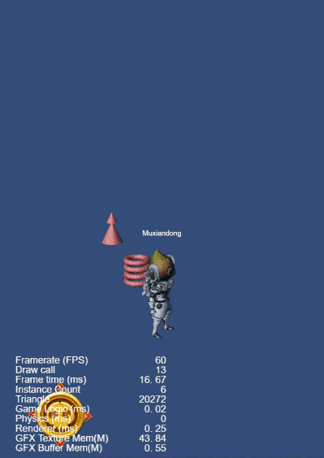

## CocosCreatorDemos
#### CocosCreatorDemos provides some user's needs DEMOs, hoping to provide users with some inspiration.
#### Cocos Creator v3.4.x

| 序号 | 标签 | 项目 | 备注 |
| :--- | :---: | :---: | :---: |
| 1.1 | 2D/3D | [3D模型显示在UI中(UIMeshRenderer)](https://gitee.com/yeshao2069/CocosCreatorDemos/tree/v3.4.x/demo/Creator3.4.2_UIMeshRenderer)   | 无 |

| 序号 | 标签 | 项目 | 备注 |
| :--- | :---: | :---: | :---: |
| 1.2 | 2D/3D | [骨骼动画显示在UI中(UIMeshRenderer)](https://gitee.com/yeshao2069/CocosCreatorDemos/tree/v3.4.x/demo/Creator3.4.2_UIMeshRenderer_SkeletalAnim)   | 无 |

| 序号 | 标签 | 项目 | 备注 |
| :--- | :---: | :---: | :---: |
| 1.3 | 2D/3D | [3D模型显示在UI中(RenderTexture)](https://gitee.com/yeshao2069/CocosCreatorDemos/tree/v3.4.x/demo/Creator3.4.2_RenderTexture)   | 无 |

| 序号 | 标签 | 项目 | 备注 |
| :--- | :---: | :---: | :---: |
| 1.4 | 2D/3D | [骨骼动画显示在UI中(RenderTexture)](https://gitee.com/yeshao2069/CocosCreatorDemos/tree/v3.4.x/demo/Creator3.4.2_RenderTexture_SkeletalAnim)   | 无 |

| 序号 | 标签 | 项目 | 备注 |
| :--- | :---: | :---: | :---: |
| 1.5 | 2D | [物体追踪](https://gitee.com/yeshao2069/CocosCreatorDemos/tree/v3.4.x/demo/Creator3.4.2_2D_BulletFollow)  | 无 |

| 序号 | 标签 | 项目 | 备注 |
| :--- | :---: | :---: | :---: |
| 1.6 | 2D | [KTV歌词](https://gitee.com/yeshao2069/CocosCreatorDemos/tree/v3.4.x/demo/Creator3.4.2_2D_KTVLabel)  | 无 |

| 序号 | 标签 | 项目 | 备注 |
| :--- | :---: | :---: | :---: |
| 1.7 | 2D | [无限视差滚动背景](https://gitee.com/yeshao2069/CocosCreatorDemos/tree/v3.4.x/demo/Creator3.4.2_2D_ScrollingBackground)  | 无 |

| 序号 | 标签 | 项目 | 备注 |
| :--- | :---: | :---: | :---: |
| 1.8 | 2D | [虚拟摇杆](https://gitee.com/yeshao2069/CocosCreatorDemos/tree/v3.4.x/demo/Creator3.4.2_2D_VirtualJoyStick)  | 无 |

| 序号 | 标签 | 项目 | 备注 |
| :--- | :---: | :---: | :---: |
| 1.9 | 2D | [屏幕点击震动](https://gitee.com/yeshao2069/CocosCreatorDemos/tree/v3.4.x/demo/Creator3.4.2_2D_ScreenVibrating)  | 无 |

| 序号 | 标签 | 项目 | 备注 |
| :--- | :---: | :---: | :---: |
| 1.10 | 2D | [金币落袋](https://gitee.com/yeshao2069/CocosCreatorDemos/tree/v3.4.x/demo/Creator3.4.2_2D_CoinFlyToWallet)  | 无 |

| 序号 | 标签 | 项目 | 备注 |
| :--- | :---: | :---: | :---: |
| 1.11 | 2D | [场景小地图](https://gitee.com/yeshao2069/CocosCreatorDemos/tree/v3.4.x/demo/Creator3.4.2_2D_SceneMiniMap)  | 无 |

| 序号 | 标签 | 项目 | 备注 |
| :--- | :---: | :---: | :---: |
| 1.12 | 2D | [双人同屏](https://gitee.com/yeshao2069/CocosCreatorDemos/tree/v3.4.x/demo/Creator3.4.2_2D_DualSplitScreen)  | 无 |

| 序号 | 标签 | 项目 | 备注 |
| :--- | :---: | :---: | :---: |
| 1.13 | 2D | [2D围绕物体旋转一周](https://gitee.com/yeshao2069/CocosCreatorDemos/tree/v3.4.x/demo/Creator3.4.2_2D_CameraRotateAround)  | 无 |

| 序号 | 标签 | 项目 | 备注 |
| :--- | :---: | :---: | :---: |
| 1.14 | 2D | [2D物体移动残影](https://gitee.com/yeshao2069/CocosCreatorDemos/tree/v3.4.x/demo/Creator3.4.2_2D_ObjectMovingShadow)  | 无 |

| 序号 | 标签 | 项目 | 备注 |
| :--- | :---: | :---: | :---: |
| 1.15 | 2D | [2D物体移动残影(spine)](https://gitee.com/yeshao2069/CocosCreatorDemos/tree/v3.4.x/demo/Creator3.4.2_2D_ObjectMovingShadow_Spine)  | 无 |

| 序号 | 标签 | 项目 | 备注 |
| :--- | :---: | :---: | :---: |
| 1.16 | 2D | [循环旋转菜单](https://gitee.com/yeshao2069/CocosCreatorDemos/tree/v3.4.x/demo/Creator3.4.2_2D_CircularMenu)  | 无 |

| 序号 | 标签 | 项目 | 备注 |
| :--- | :---: | :---: | :---: |
| 1.17 | 2D | [无限循环的翻页组件](https://gitee.com/yeshao2069/CocosCreatorDemos/tree/v3.4.x/demo/Creator3.4.2_2D_CircleScrollview)  | 无 |

| 序号 | 标签 | 项目 | 备注 |
| :--- | :---: | :---: | :---: |
| 1.18 | 2D | [打印机文字](https://gitee.com/yeshao2069/CocosCreatorDemos/tree/v3.4.x/demo/Creator3.4.2_2D_PrinterWord)  | 无 |

| 序号 | 标签 | 项目 | 备注 |
| :--- | :---: | :---: | :---: |
| 1.19 | 2D | [放大镜](https://gitee.com/yeshao2069/CocosCreatorDemos/tree/v3.4.x/demo/Creator3.4.2_2D_Magnifier)  | 无 |

| 序号 | 标签 | 项目 | 备注 |
| :--- | :---: | :---: | :---: |
| 1.20 | 2D | [刮刮卡](https://gitee.com/yeshao2069/CocosCreatorDemos/tree/v3.4.x/demo/Creator3.4.2_2D_ScratchCard)  | 无 |

| 序号 | 标签 | 项目 | 备注 |
| :--- | :---: | :---: | :---: |
| 1.21 | 2D | [可视化算法](https://gitee.com/yeshao2069/CocosCreatorDemos/tree/v3.4.x/demo/Creator3.4.2_2D_VisualizationAlgorithm)  | 无 |

| 序号 | 标签 | 项目 | 备注 |
| :--- | :---: | :---: | :---: |
| 1.22 | 2D | 2D流体 [3.4.0版本](https://gitee.com/yeshao2069/CocosCreatorDemos/tree/v3.4.x/demo/Creator3.4.0_2D_Fluids) [3.4.2版本](https://gitee.com/yeshao2069/CocosCreatorDemos/tree/v3.4.x/demo/Creator3.4.2_2D_Fluids) | 3.4.0版本和3.4.2版本有差异, 引擎重构问题 |

| 序号 | 标签 | 项目 | 备注 |
| :--- | :---: | :---: | :---: |
| 1.23 | 2D | [2D光照](https://gitee.com/yeshao2069/CocosCreatorDemos/tree/v3.4.x/demo/Creator3.4.2_2D_Light)  | 无 |

| 序号 | 标签 | 项目 | 备注 |
| :--- | :---: | :---: | :---: |
| 1.24 | 2D | [2D阴影](https://gitee.com/yeshao2069/CocosCreatorDemos/tree/v3.4.x/demo/Creator3.4.2_2D_ShadowMap)  | 无 |

| 序号 | 标签 | 项目 | 备注 |
| :--- | :---: | :---: | :---: |
| 1.25 | 2D | [龙骨动画指定帧播放](https://gitee.com/yeshao2069/CocosCreatorDemos/tree/v3.4.x/demo/Creator3.4.2_2D_DragonBonesSpecifiedFrame)  | 无 |

| 序号 | 标签 | 项目 | 备注 |
| :--- | :---: | :---: | :---: |
| 1.26 | 2D | [Spine动画指定帧播放](https://gitee.com/yeshao2069/CocosCreatorDemos/tree/v3.4.x/demo/Creator3.4.2_2D_SpineSpecifiedFrame)  | 无 |

| 序号 | 标签 | 项目 | 备注 |
| :--- | :---: | :---: | :---: |
| 1.27 | 2D | [GIF资源加载](https://gitee.com/yeshao2069/CocosCreatorDemos/tree/v3.4.x/demo/Creator3.4.2_2D_GifResourceLoading)  | 无 |

| 序号 | 标签 | 项目 | 备注 |
| :--- | :---: | :---: | :---: |
| 1.28 | 2D | [画板](https://gitee.com/yeshao2069/CocosCreatorDemos/tree/v3.4.x/demo/Creator3.4.2_2D_DrawingBoard)  | 无 |

| 序号 | 标签 | 项目 | 备注 |
| :--- | :---: | :---: | :---: |
| 1.29 | 2D | [列表视图扩展](https://gitee.com/yeshao2069/CocosCreatorDemos/tree/v3.4.x/demo/Creator3.4.2_2D_ListViewExtension)  | 无 |

| 序号 | 标签 | 项目 | 备注 |
| :--- | :---: | :---: | :---: |
| 1.30 | 2D | [自定义形状遮罩](https://gitee.com/yeshao2069/CocosCreatorDemos/tree/v3.4.x/demo/Creator3.4.2_2D_Mask_Polygon)  | 无 |

| 序号 | 标签 | 项目 | 备注 |
| :--- | :---: | :---: | :---: |
| 1.31 | 2D | [Spine局部换装](https://gitee.com/yeshao2069/CocosCreatorDemos/tree/v3.4.x/demo/Creator3.4.2_2D_SpineChangeSlotWithTexture)  | 无 |

| 序号 | 标签 | 项目 | 备注 |
| :--- | :---: | :---: | :---: |
| 1.32 | 2D | [旋转循环页视图实现](https://gitee.com/yeshao2069/CocosCreatorDemos/tree/v3.4.x/demo/Creator3.4.2_2D_RevolvePageView)  | 无 |

| 序号 | 标签 | 项目 | 备注 |
| :--- | :---: | :---: | :---: |
| 1.33 | 2D | 图片切割 [3.4.0版本](https://gitee.com/yeshao2069/CocosCreatorDemos/tree/v3.4.x/demo/Creator3.4.0_2D_SpriteSplit)  [3.4.2版本](https://gitee.com/yeshao2069/CocosCreatorDemos/tree/v3.4.x/demo/Creator3.4.2_2D_SpriteSplit) | 3.4.0版本和3.4.2版本有差异, 引擎重构问题 |

| 序号 | 标签 | 项目 | 备注 |
| :--- | :---: | :---: | :---: |
| 1.34 | 2D | [Spine骨骼控制](https://gitee.com/yeshao2069/CocosCreatorDemos/tree/v3.4.x/demo/Creator3.4.2_2D_SpineDragController) | 无 |

| 序号 | 标签 | 项目 | 备注 |
| :--- | :---: | :---: | :---: |
| 1.35 | 2D | [音视频倍数播放](https://gitee.com/yeshao2069/CocosCreatorDemos/tree/v3.4.x/demo/Creator3.4.2_MediaPlaybackRate) | 无 |

| 序号 | 标签 | 项目 | 备注 |
| :--- | :---: | :---: | :---: |
| 2.1 | 3D | [3D围绕物体旋转一周(旋转摄像机)](https://gitee.com/yeshao2069/CocosCreatorDemos/tree/v3.4.x/demo/Creator3.4.2_3D_CameraRotateAround)  | 无 |

| 序号 | 标签 | 项目 | 备注 |
| :--- | :---: | :---: | :---: |
| 2.2 | 3D | [3D围绕物体旋转一周(四元数)](https://gitee.com/yeshao2069/CocosCreatorDemos/tree/v3.4.x/demo/Creator3.4.2_3D_CameraRotateAround_Quat)  | 无 |

| 序号 | 标签 | 项目 | 备注 |
| :--- | :---: | :---: | :---: |
| 2.3 | 3D | [3D文本](https://gitee.com/yeshao2069/CocosCreatorDemos/tree/v3.4.x/demo/Creator3.4.2_3D_ModelText)  | 无 |

| 序号 | 标签 | 项目 | 备注 |
| :--- | :---: | :---: | :---: |
| 2.4 | 3D | [第一人称射击](https://gitee.com/yeshao2069/CocosCreatorDemos/tree/v3.4.x/demo/Creator3.4.2_3D_FirstPersonShooting)  | 无 |

| 序号 | 标签 | 项目 | 备注 |
| :--- | :---: | :---: | :---: |
| 2.5 | 3D | [第一人称视角](https://gitee.com/yeshao2069/CocosCreatorDemos/tree/v3.4.x/demo/Creator3.4.2_3D_FirstPersonPerspective)  | 无 |

| 序号 | 标签 | 项目 | 备注 |
| :--- | :---: | :---: | :---: |
| 2.6 | 3D | [3D模型点击旋转](https://gitee.com/yeshao2069/CocosCreatorDemos/tree/v3.4.x/demo/Creator3.4.2_3D_ModelTouchAround)  | 无 |

| 序号 | 标签 | 项目 | 备注 |
| :--- | :---: | :---: | :---: |
| 2.7 | 3D | [3D围绕物体旋转(自转)](https://gitee.com/yeshao2069/CocosCreatorDemos/tree/v3.4.x/demo/Creator3.4.2_3D_SelfRotateAround)  | 无 |

| 序号 | 标签 | 项目 | 备注 |
| :--- | :---: | :---: | :---: |
| 2.8 | 3D | [模型换肤](https://gitee.com/yeshao2069/CocosCreatorDemos/tree/v3.4.x/demo/Creator3.4.2_3D_ModelDressup)  | 无 |

| 序号 | 标签 | 项目 | 备注 |
| :--- | :---: | :---: | :---: |
| 2.9 | 3D | [骨骼动画指定帧播放](https://gitee.com/yeshao2069/CocosCreatorDemos/tree/v3.4.x/demo/Creator3.4.2_3D_SkeletalAnimationSpecifiedFrame)  | 无 |

| 序号 | 标签 | 项目 | 备注 |
| :--- | :---: | :---: | :---: |
| 2.10 | 3D | [3D模型切割](https://gitee.com/yeshao2069/CocosCreatorDemos/tree/v3.4.x/demo/Creator3.4.2_3D_MeshCutter)  | 无 |

| 序号 | 标签 | 项目 | 备注 |
| :--- | :---: | :---: | :---: |
| 2.11 | 3D | [3D模型运动变速](https://gitee.com/yeshao2069/CocosCreatorDemos/tree/v3.4.x/demo/Creator3.4.2_3D_TweenGameTimeScale)  | 无 |

| 序号 | 标签 | 项目 | 备注 |
| :--- | :---: | :---: | :---: |
| 2.12 | 3D | [3D骨骼动画移动残影](https://gitee.com/yeshao2069/CocosCreatorDemos/tree/v3.4.x/demo/Creator3.4.2_3D_ModelResidualShadows)  | 无 |

### Mark
Cocos Creator 3.4.x 版本列举 Demo 共 49 种(其中 2D 37 种(包含 图片分割 3.4.0 和 2D 流体 3.4.0 两种不兼容 3.4.2 的版本)，3D 12 种)，会同步更新到 Cocos Creator 3.5.x 版本，后续 Cocos Creator 3.4.x 将不会同步新的 Demo，请移步到 3.5.x 版本查看最新效果