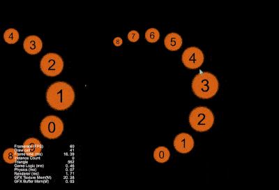

## CocosCreatorDemos
### Purpose
CocosCreatorDemos provides some user's needs DEMOs, hoping to provide users with some inspiration.
### Version
Cocos Creator v3.6.x

### 2D
| A1 | B1 | A2 | B2 | A3 | B3 |
| :---: | :--- | :---: | :--- | :---: | :--- |
| 1 | [UIMeshRenderer (Model)](#uimeshrenderermodel) | 2 | [UIMeshRenderer (Skeletal Animation)](#uimeshrendererskelanim) | 3 | [RenderTexture (Model)](#rendertexturemodel) |
| 4 | [RenderTexture (Skeletal Animation)](#rendertextureskelanim) | 5 | [Bullet Follow](#bulletfollow) | 6 | [KTV Label](#ktvlabel) |
| 7 | [Scrolling Background](#scrollingbackground) | 8 | [Virtual Joy Stick](#virtualjoystick) | 9 | [Screen Vibrating](#screenvibrating) |
| 10 | [Coin Fly To Wallet](#coinflytowallet) | 11 | [Scene Mini Map](#sceneminimap) | 12 | [Dual Split Screen](#dualsplitscreen) |
| 13 | [2D Camera Rotate Around](#camerarotatearound2d) | 14 | [Object Moving Shadow (Sprite)](#objectmovingshadow) | 15 | [Object Moving Shadow (Spine)](#objectmovingshadowspine) |
| 16 | [Circular Menu](#circularmenu) | 17 | [Circle ScrollView](#circlescrollview) | 18 | [Printer Word](#printerword) |
| 19 | [Magnifier](#magnifier) | 20 | [Scratch Card](#scratchcard) | 21 | [Visualization Algorithm](#visualizationalgorithm) |
| 22 | [2D Fluids](#fluids2d) | 23 | [2D Light](#light2d) | 24 | [2D Shadow Map](#shadowmap2d) |
| 25 | [Gif Resource Loading](#gifresourceloading) | 26 | [Drawing Board](#drawingboard) | 27 | [ListView Extension](#listviewextension) |
| 28 | [Mask Polygon](#MaskPolygon) | 29 | [Water Surface Reflection](#watersurfacereflection) | 30 | [Waiting Elevator](#waitingelevator) |
| 31 | [Spine Change Slot With Texture](#spinechangeslotwithtexture) | 32 | [Revolve PageView](#revolvepageview) | 33 | [Sprite Split](#spritesplit) |
| 34 | [Spine Drag Controller](#spinedragcontroller) | 35 | [Media Playback Rate](#mediaplaybackrate) | 36 | [TiledMap Path Finding](#tilemappathfinding) |
| 37 | [剪切板](#copyfile) | 38 | [Card Flip](#cardflip) | 39 | [Card Queue](#cardqueue) |
| 40 | [Card Flip And Queue](#cardflipandqueue) | 41 | [Raphael (Graphics Extend And SVG Extend)](#raphael) | 42 | [Rotate Loop PageView](#rotatelooppageview) |
| 43 | [Lottery Rolling](#lotteryrolling) | 44 | [Get UV From The Atlas](#getuvfromtheatlas) | 45 | [Role Follow](#getuvfromtheatlas) |
| 46 | [Visualization Algorithm (Bar Chart)](#visualizationalgorithm2) | 47 | [Steering Behavior](#steeringbehavior) |

### 3D
| A1 | B1 | A2 | B2 | A3 | B3 |
| :---: | :--- | :---: | :--- | :---: | :--- |
| 1 | [3D Camera Rotate Around](#camerarotatearound3d) | 2 | [3D Camera Rotate Around (Quat)](#camerarotatearound3dquat) | 3 | [3D Text](#modeltext) |
| 4 | [First Person Shooting](#firstpersonshooting) | 5 | [First Person Perspective](#firstpersonperspective) | 6 | [Model Touch Around](#modeltoucharound) |
| 7 | [Self Rotae Around](#selfrotatearound) | 8 | [Model Dress Up](#modeldressup) | 9 | [Model Mesh Cutter](#meshcutter) |
| 10 | [Model Tween Game TimeScale](#tweengametimescale) | 11 | [Model Residual Shadows](#modelresidualshadows) | 12 | [Dynamic Mesh](#dynamicmesh) |
| 13 | [Model Viewer](#modelviewer) | 14 | [Skybox Viewer](#skybox) | 15 | [Lightning Whip](#lightningwhip) |
| 16 | [Cartoon Vegetation](#cartoonvegetation) | 17 | [FPS First Person Shooting](#fpsfirstperson) | 18 | [Custom BillBoard](#custombillboard) |
| 19 | [Morroring](#mirroring) | 20 | [3D Label](#label3d) | 21 | [3D Portal](#portal3d) |

### 2D_Game
| A1 | B1 | A2 | B2 | A3 | B3 |
| :---: | :---: | :---: | :---: | :---: | :---: |
| 1 | [Life Restart](#liferestart) |

### 3D_Game
| A1 | B1 | A2 | B2 | A3 | B3 |
| :---: | :---: | :---: | :---: | :---: | :---: |
| 1 | [Air Pla3D ne](#airplane3d) | 2 | [Taxi 3D](#taxi3d) | 3 | [Running 3D](#running3d) |
| 4 | [Shooting 3D](#shooting3d) |

### UIMeshRendererModel
| No. | Type | Project | Creator Version | Back To Top | Mark |
| :--- | :---: | :---: | :---: | :---: | :---: |
| 1.1 | 2D | [UIMeshRenderer (Model)](https://github.com/yeshao2069/CocosCreatorDemos/tree/v3.6.x/demo/2d/Creator3.6.0_UIMeshRenderer) | 3.6.0 | [Back To Top](#2d) | Empty |

### UIMeshRendererSkelAnim
| No. | Type | Project | Creator Version | Back To Top | Mark |
| :--- | :---: | :---: | :---: | :---: | :---: |
| 1.2 | 2D | [UIMeshRenderer (Skeletal Animation)](https://github.com/yeshao2069/CocosCreatorDemos/tree/v3.6.x/demo/2d/Creator3.6.0_UIMeshRenderer_SkeletalAnim) | 3.6.0 | [Back To Top](#2d) | Empty |

### RenderTextureModel
| No. | Type | Project | Creator Version | Back To Top | Mark |
| :--- | :---: | :---: | :---: | :---: | :---: |
| 1.3 | 2D | [RenderTexture (Model)](https://github.com/yeshao2069/CocosCreatorDemos/tree/v3.6.x/demo/2d/Creator3.6.0_RenderTexture) | 3.6.0 | [Back To Top](#2d) | Empty |

### RenderTextureSkelAnim
| No. | Type | Project | Creator Version | Back To Top | Mark |
| :--- | :---: | :---: | :---: | :---: | :---: |
| 1.4 | 2D | [RenderTexture (Skeletal Animation)](https://github.com/yeshao2069/CocosCreatorDemos/tree/v3.6.x/demo/2d/Creator3.6.0_RenderTexture_SkeletalAnim) | 3.6.0 | [Back To Top](#2d) | Empty |

### BulletFollow
| No. | Type | Project | Creator Version | Back To Top | Mark |
| :--- | :---: | :---: | :---: | :---: | :---: |
| 1.5 | 2D | [Bullet Follow](https://github.com/yeshao2069/CocosCreatorDemos/tree/v3.6.x/demo/2d/Creator3.6.0_2D_BulletFollow) | 3.6.0 | [Back To Top](#2d) | Empty |

### KTVLabel
| No. | Type | Project | Creator Version | Back To Top | Mark |
| :--- | :---: | :---: | :---: | :---: | :---: |
| 1.6 | 2D | [KTV Label](https://github.com/yeshao2069/CocosCreatorDemos/tree/v3.6.x/demo/2d/Creator3.6.0_2D_KTVLabel) | 3.6.0 | [Back To Top](#2d) | Empty |

### ScrollingBackground
| No. | Type | Project | Creator Version | Back To Top | Mark |
| :--- | :---: | :---: | :---: | :---: | :---: |
| 1.7 | 2D | [Scrolling Background](https://github.com/yeshao2069/CocosCreatorDemos/tree/v3.6.x/demo/2d/Creator3.6.0_2D_ScrollingBackground) | 3.6.0 | [Back To Top](#2d) | Empty |

### VirtualJoyStick
| No. | Type | Project | Creator Version | Back To Top | Mark |
| :--- | :---: | :---: | :---: | :---: | :---: |
| 1.8 | 2D | [Virtual Joy Stick](https://github.com/yeshao2069/CocosCreatorDemos/tree/v3.6.x/demo/2d/Creator3.6.0_2D_VirtualJoyStick) | 3.6.0 | [Back To Top](#2d) | Empty |

### ScreenVibrating
| No. | Type | Project | Creator Version | Back To Top | Mark |
| :--- | :---: | :---: | :---: | :---: | :---: |
| 1.9 | 2D | [Screen Vibrating](https://github.com/yeshao2069/CocosCreatorDemos/tree/v3.6.x/demo/2d/Creator3.6.0_2D_ScreenVibrating) | 3.6.0 | [Back To Top](#2d) | Empty |

### CoinFlyToWallet
| No. | Type | Project | Creator Version | Back To Top | Mark |
| :--- | :---: | :---: | :---: | :---: | :---: |
| 1.10 | 2D | [Coin Fly To Wallet](https://github.com/yeshao2069/CocosCreatorDemos/tree/v3.6.x/demo/2d/Creator3.6.0_2D_CoinFlyToWallet) | 3.6.0 | [Back To Top](#2d) | Empty |

### SceneMiniMap
| No. | Type | Project | Creator Version | Back To Top | Mark |
| :--- | :---: | :---: | :---: | :---: | :---: |
| 1.11 | 2D | [Scene Mini Map](https://github.com/yeshao2069/CocosCreatorDemos/tree/v3.6.x/demo/2d/Creator3.6.0_2D_SceneMiniMap) | 3.6.0 | [Back To Top](#2d) | Empty |

### DualSplitScreen
| No. | Type | Project | Creator Version | Back To Top | Mark |
| :--- | :---: | :---: | :---: | :---: | :---: |
| 1.12 | 2D | [Dual Split Screen](https://github.com/yeshao2069/CocosCreatorDemos/tree/v3.6.x/demo/2d/Creator3.6.0_2D_DualSplitScreen) | 3.6.0 | [Back To Top](#2d) | Empty |

### CameraRotateAround2D
| No. | Type | Project | Creator Version | Back To Top | Mark |
| :--- | :---: | :---: | :---: | :---: | :---: |
| 1.13 | 2D | [2D Camera Rotate Around](https://github.com/yeshao2069/CocosCreatorDemos/tree/v3.6.x/demo/2d/Creator3.6.0_2D_CameraRotateAround) | 3.6.0 | [Back To Top](#2d) | Empty |

### ObjectMovingShadow
| No. | Type | Project | Creator Version | Back To Top | Mark |
| :--- | :---: | :---: | :---: | :---: | :---: |
| 1.14 | 2D | [Object Moving Shadow (Sprite)](https://github.com/yeshao2069/CocosCreatorDemos/tree/v3.6.x/demo/2d/Creator3.6.0_2D_ObjectMovingShadow) | 3.6.0 | [Back To Top](#2d) | Empty |

### ObjectMovingShadowSpine
| No. | Type | Project | Creator Version | Back To Top | Mark |
| :--- | :---: | :---: | :---: | :---: | :---: |
| 1.15 | 2D | [Object Moving Shadow (Spine)](https://github.com/yeshao2069/CocosCreatorDemos/tree/v3.6.x/demo/2d/Creator3.6.0_2D_ObjectMovingShadow_Spine) | 3.6.0 | [Back To Top](#2d) | Empty |

### CircularMenu
| No. | Type | Project | Creator Version | Back To Top | Mark |
| :--- | :---: | :---: | :---: | :---: | :---: |
| 1.16 | 2D | [Circular Menu](https://github.com/yeshao2069/CocosCreatorDemos/tree/v3.6.x/demo/2d/Creator3.6.0_2D_CircularMenu) | 3.6.0 | [Back To Top](#2d) | Empty |

### CircleScrollview
| No. | Type | Project | Creator Version | Back To Top | Mark |
| :--- | :---: | :---: | :---: | :---: | :---: |
| 1.17 | 2D | [Circle ScrollView](https://github.com/yeshao2069/CocosCreatorDemos/tree/v3.6.x/demo/2d/Creator3.6.1_2D_CircleScrollview) | 3.6.1 | [Back To Top](#2d) | Empty |

### PrinterWord
| No. | Type | Project | Creator Version | Back To Top | Mark |
| :--- | :---: | :---: | :---: | :---: | :---: |
| 1.18 | 2D | [Printer Word](https://github.com/yeshao2069/CocosCreatorDemos/tree/v3.6.x/demo/2d/Creator3.6.0_2D_PrinterWord) | 3.6.0 | [Back To Top](#2d) | Empty |

### Magnifier
| No. | Type | Project | Creator Version | Back To Top | Mark |
| :--- | :---: | :---: | :---: | :---: | :---: |
| 1.19 | 2D | [Magnifier](https://github.com/yeshao2069/CocosCreatorDemos/tree/v3.6.x/demo/2d/Creator3.6.0_2D_Magnifier) | 3.6.0 | [Back To Top](#2d) | Empty |

### ScratchCard
| No. | Type | Project | Creator Version | Back To Top | Mark |
| :--- | :---: | :---: | :---: | :---: | :---: |
| 1.20 | 2D | [Scratch Card](https://github.com/yeshao2069/CocosCreatorDemos/tree/v3.6.x/demo/2d/Creator3.6.0_2D_ScratchCard) | 3.6.0 | [Back To Top](#2d) | Empty |

### VisualizationAlgorithm
| No. | Type | Project | Creator Version | Back To Top | Mark |
| :--- | :---: | :---: | :---: | :---: | :---: |
| 1.21 | 2D | [Visualization Algorithm](https://github.com/yeshao2069/CocosCreatorDemos/tree/v3.6.x/demo/2d/Creator3.6.0_2D_VisualizationAlgorithm) | 3.6.0 | [Back To Top](#2d) | Empty |

### Fluids2D
| No. | Type | Project | Creator Version | Back To Top | Mark |
| :--- | :---: | :---: | :---: | :---: | :---: |
| 1.22 | 2D | [2D Fluids](https://github.com/yeshao2069/CocosCreatorDemos/tree/v3.6.x/demo/2d/Creator3.6.0_2D_Fluids) | [Back To Top](#2d) | Empty |

### Light2D
| No. | Type | Project | Creator Version | Back To Top | Mark |
| :--- | :---: | :---: | :---: | :---: | :---: |
| 1.23 | 2D | [2D Light](https://github.com/yeshao2069/CocosCreatorDemos/tree/v3.6.x/demo/2d/Creator3.6.1_2D_Light) | 3.6.1 | [Back To Top](#2d) | Empty |

### ShadowMap2D
| No. | Type | Project | Creator Version | Back To Top | Mark |
| :--- | :---: | :---: | :---: | :---: | :---: |
| 1.24 | 2D | [2D Shadow Map](https://github.com/yeshao2069/CocosCreatorDemos/tree/v3.6.x/demo/2d/Creator3.6.0_2D_ShadowMap) | 3.6.0 | [Back To Top](#2d) | Empty |

### GifResourceLoading
| No. | Type | Project | Creator Version | Back To Top | Mark |
| :--- | :---: | :---: | :---: | :---: | :---: |
| 1.25 | 2D | [Gif Resource Loading](https://github.com/yeshao2069/CocosCreatorDemos/tree/v3.6.x/demo/2d/Creator3.6.0_2D_GifResourceLoading) | 3.6.0 | [Back To Top](#2d) | Empty |

### DrawingBoard
| No. | Type | Project | Creator Version | Back To Top | Mark |
| :--- | :---: | :---: | :---: | :---: | :---: |
| 1.26 | 2D | [Drawing Board](https://github.com/yeshao2069/CocosCreatorDemos/tree/v3.6.x/demo/2d/Creator3.6.0_2D_DrawingBoard) | 3.6.0 | [Back To Top](#2d) | Empty |

### ListViewExtension
| No. | Type | Project | Creator Version | Back To Top | Mark |
| :--- | :---: | :---: | :---: | :---: | :---: |
| 1.27 | 2D | [ListView Extension](https://github.com/yeshao2069/CocosCreatorDemos/tree/v3.6.x/demo/2d/Creator3.6.0_2D_ListViewExtension) | 3.6.0 | [Back To Top](#2d) | Empty |

### MaskPolygon
| No. | Type | Project | Creator Version | Back To Top | Mark |
| :--- | :---: | :---: | :---: | :---: | :---: |
| 1.28 | 2D | [Mask Polygon](https://github.com/yeshao2069/CocosCreatorDemos/tree/v3.6.x/demo/2d/Creator3.6.0_2D_Mask_Polygon) | 3.6.0 | [Back To Top](#2d) | Empty |

### WaterSurfaceReflection
| No. | Type | Project | Creator Version | Back To Top | Mark |
| :--- | :---: | :---: | :---: | :---: | :---: |
| 1.29 | 2D | [Water Surface Reflection](https://github.com/yeshao2069/CocosCreatorDemos/tree/v3.6.x/demo/2d/Creator3.6.0_2D_WaterSurfaceReflection) | 3.6.0 | [Back To Top](#2d) | Empty |

### WaitingElevator
| No. | Type | Project | Creator Version | Back To Top | Mark |
| :--- | :---: | :---: | :---: | :---: | :---: |
| 1.30 | 2D | [Waiting Elevator](https://github.com/yeshao2069/CocosCreatorDemos/tree/v3.6.x/demo/2d/Creator3.6.0_2D_WaitingElevator) | 3.6.0 | [Back To Top](#2d) | Empty |

### CameraRotateAround3D
| No. | Type | Project | Creator Version | Back To Top | Mark |
| :--- | :---: | :---: | :---: | :---: | :---: |
| 2.1 | 3D | [3D Camera Rotate Around](https://github.com/yeshao2069/CocosCreatorDemos/tree/v3.6.x/demo/3d/Creator3.6.0_3D_CameraRotateAround) | 3.6.0 | [Back To Top](#3d) | Empty |

### CameraRotateAround3DQuat
| No. | Type | Project | Creator Version | Back To Top | Mark |
| :--- | :---: | :---: | :---: | :---: | :---: |
| 2.2 | 3D | [3D Camera Rotate Around (Quat)](https://github.com/yeshao2069/CocosCreatorDemos/tree/v3.6.x/demo/3d/Creator3.6.0_3D_CameraRotateAround_Quat) | 3.6.0 | [Back To Top](#3d) | Empty |

### ModelText
| No. | Type | Project | Creator Version | Back To Top | Mark |
| :--- | :---: | :---: | :---: | :---: | :---: |
| 2.3 | 3D | [3D Text](https://github.com/yeshao2069/CocosCreatorDemos/tree/v3.6.x/demo/3d/Creator3.6.0_3D_ModelText) | 3.6.0 | [Back To Top](#3d) | Empty |

### FirstPersonShooting
| No. | Type | Project | Creator Version | Back To Top | Mark |
| :--- | :---: | :---: | :---: | :---: | :---: |
| 2.4 | 3D | [First Person Shooting](https://github.com/yeshao2069/CocosCreatorDemos/tree/v3.6.x/demo/3d/Creator3.6.0_3D_FirstPersonShooting) | 3.6.0 | [Back To Top](#3d) | Empty |

### FirstPersonPerspective
| No. | Type | Project | Creator Version | Back To Top | Mark |
| :--- | :---: | :---: | :---: | :---: | :---: |
| 2.5 | 3D | [First Person Perspective](https://github.com/yeshao2069/CocosCreatorDemos/tree/v3.6.x/demo/3d/Creator3.6.0_3D_FirstPersonPerspective) | 3.6.0 | [Back To Top](#3d) | Empty |

### ModelTouchAround
| No. | Type | Project | Creator Version | Back To Top | Mark |
| :--- | :---: | :---: | :---: | :---: | :---: |
| 2.6 | 3D | [Model Touch Around](https://github.com/yeshao2069/CocosCreatorDemos/tree/v3.6.x/demo/3d/Creator3.6.0_3D_ModelTouchAround) | 3.6.0 | [Back To Top](#3d) | Empty |

### SelfRotateAround
| No. | Type | Project | Creator Version | Back To Top | Mark |
| :--- | :---: | :---: | :---: | :---: | :---: |
| 2.7 | 3D | [Self Rotae Around](https://github.com/yeshao2069/CocosCreatorDemos/tree/v3.6.x/demo/3d/Creator3.6.0_3D_SelfRotateAround) | 3.6.0 | [Back To Top](#3d) | Empty |

### ModelDressup
| No. | Type | Project | Creator Version | Back To Top | Mark |
| :--- | :---: | :---: | :---: | :---: | :---: |
| 2.8 | 3D | [Model Dress Up](https://github.com/yeshao2069/CocosCreatorDemos/tree/v3.6.x/demo/3d/Creator3.6.0_3D_ModelDressup) | 3.6.0 | [Back To Top](#3d) | Empty |

### MeshCutter
| No. | Type | Project | Creator Version | Back To Top | Mark |
| :--- | :---: | :---: | :---: | :---: | :---: |
| 2.9 | 3D | [Model Mesh Cutter](https://github.com/yeshao2069/CocosCreatorDemos/tree/v3.6.x/demo/3d/Creator3.6.0_3D_MeshCutter) | 3.6.0 | [Back To Top](#3d) | Empty |

### TweenGameTimeScale
| No. | Type | Project | Creator Version | Back To Top | Mark |
| :--- | :---: | :---: | :---: | :---: | :---: |
| 2.10 | 3D | [Model Tween Game TimeScale](https://github.com/yeshao2069/CocosCreatorDemos/tree/v3.6.x/demo/3d/Creator3.6.0_3D_TweenGameTimeScale) | 3.6.0 | [Back To Top](#3d) | Empty |

### ModelResidualShadows
| No. | Type | Project | Creator Version | Back To Top | Mark |
| :--- | :---: | :---: | :---: | :---: | :---: |
| 2.11 | 3D | [Model Residual Shadows](https://github.com/yeshao2069/CocosCreatorDemos/tree/v3.6.x/demo/3d/Creator3.6.0_3D_ModelResidualShadows) | 3.6.0 | [Back To Top](#3d) | Empty |

### DynamicMesh
| No. | Type | Project | Creator Version | Back To Top | Mark |
| :--- | :---: | :---: | :---: | :---: | :---: |
| 2.12 | 3D | [Dynamic Mesh](https://github.com/yeshao2069/CocosCreatorDemos/tree/v3.6.x/demo/3d/Creator3.6.0_3D_DynamicMesh) | 3.6.0 | [Back To Top](#3d) | Empty |

### ModelViewer
| No. | Type | Project | Creator Version | Back To Top | Mark |
| :--- | :---: | :---: | :---: | :---: | :---: |
| 2.13 | 3D | [Model Viewer](https://github.com/yeshao2069/CocosCreatorDemos/tree/v3.6.x/demo/3d/Creator3.6.0_3D_ModelViewer) | 3.6.0 | [Back To Top](#3d) | Empty |

### Skybox
| No. | Type | Project | Creator Version | Back To Top | Mark |
| :--- | :---: | :---: | :---: | :---: | :---: |
| 2.14 | 3D | [Skybox Viewer](https://github.com/yeshao2069/CocosCreatorDemos/tree/v3.6.x/demo/3d/Creator3.6.0_3D_Skybox) | 3.6.0 | [Back To Top](#3d) | Empty |

### LightningWhip
| No. | Type | Project | Creator Version | Back To Top | Mark |
| :--- | :---: | :---: | :---: | :---: | :---: |
| 2.15 | 3D | [Lightning Whip](https://github.com/yeshao2069/CocosCreatorDemos/tree/v3.6.x/demo/3d/Creator3.6.0_3D_LightningWhip) | 3.6.0 | [Back To Top](#3d) | Empty |

### CartoonVegetation
| No. | Type | Project | Creator Version | Back To Top | Mark |
| :--- | :---: | :---: | :---: | :---: | :---: |
| 2.16 | 3D | [Cartoon Vegetation](https://github.com/yeshao2069/CocosCreatorDemos/tree/v3.6.x/demo/3d/Creator3.6.0_3D_CartoonVegetation) | 3.6.0 | [Back To Top](#3d) | Empty |

### FPSFirstPerson
| No. | Type | Project | Creator Version | Back To Top | Mark |
| :--- | :---: | :---: | :---: | :---: | :---: |
| 2.17 | 3D | [FPS First Person Shooting](https://github.com/yeshao2069/CocosCreatorDemos/tree/v3.6.x/demo/3d/Creator3.6.0_3D_FPS_FirstPerson) | 3.6.0 | [Back To Top](#3d) | Empty |

### CustomBillboard
| No. | Type | Project | Creator Version | Back To Top | Mark |
| :--- | :---: | :---: | :---: | :---: | :---: |
| 2.18 | 3D | [Custom BillBoard](https://github.com/yeshao2069/CocosCreatorDemos/tree/v3.6.x/demo/3d/Creator3.6.1_3D_CustomBillboard) | 3.6.1 | [Back To Top](#3d) | Empty |

### Mirroring
| No. | Type | Project | Creator Version | Back To Top | Mark |
| :--- | :---: | :---: | :---: | :---: | :---: |
| 2.19 | 3D | [Morroring](https://github.com/yeshao2069/CocosCreatorDemos/tree/v3.6.x/demo/3d/Creator3.6.0_3D_Mirroring) | 3.6.0 | [Back To Top](#3d) | Empty |

### Label3D
| No. | Type | Project | Creator Version | Back To Top | Mark |
| :--- | :---: | :---: | :---: | :---: | :---: |
| 2.20 | 3D | [3D Label](https://github.com/yeshao2069/CocosCreatorDemos/tree/v3.6.x/demo/3d/Creator3.6.1_3D_Label3D) | 3.6.1 | [Back To Top](#3d) | Empty |

### Portal3D
| No. | Type | Project | Creator Version | Back To Top | Mark |
| :--- | :---: | :---: | :---: | :---: | :---: |
| 2.21 | 3D | [3D Portal](https://github.com/yeshao2069/CocosCreatorDemos/tree/v3.6.x/demo/3d/Creator3.6.2_3D_Portal) | 3.6.2 | [Back To Top](#3d) | Empty |

### SpineChangeSlotWithTexture
| No. | Type | Project | Creator Version | Back To Top | Mark |
| :--- | :---: | :---: | :---: | :---: | :---: |
| 3.1 | 2D | [Spine Change Slot With Texture](https://github.com/yeshao2069/CocosCreatorDemos/tree/v3.6.x/demo/2dP1/Creator3.6.0_2D_SpineChangeSlotWithTexture) | 3.6.0 | [Back To Top](#2d) | Empty |

### RevolvePageView
| No. | Type | Project | Creator Version | Back To Top | Mark |
| :--- | :---: | :---: | :---: | :---: | :---: |
| 3.2 | 2D | [Revolve PageView](https://github.com/yeshao2069/CocosCreatorDemos/tree/v3.6.x/demo/2dP1/Creator3.6.0_2D_RevolvePageView) | 3.6.0 | [Back To Top](#2d) | Empty |

### SpriteSplit
| No. | Type | Project | Creator Version | Back To Top | Mark |
| :--- | :---: | :---: | :---: | :---: | :---: |
| 3.3 | 2D | [Sprite Split](https://github.com/yeshao2069/CocosCreatorDemos/tree/v3.6.x/demo/2dP1/Creator3.6.0_2D_SpriteSplit) | 3.6.0 | [Back To Top](#2d) | Empty |

### SpineDragController
| No. | Type | Project | Creator Version | Back To Top | Mark |
| :--- | :---: | :---: | :---: | :---: | :---: |
| 3.4 | 2D | [Spine Drag Controller](https://github.com/yeshao2069/CocosCreatorDemos/tree/v3.6.x/demo/2dP1/Creator3.6.0_2D_SpineDragController) | 3.6.0 | [Back To Top](#2d) | Empty |

### MediaPlaybackRate
| No. | Type | Project | Creator Version | Back To Top | Mark |
| :--- | :---: | :---: | :---: | :---: | :---: |
| 3.5 | 2D | [Media Playback Rate](https://github.com/yeshao2069/CocosCreatorDemos/tree/v3.6.x/demo/2dP1/Creator3.6.0_MediaPlaybackRate) | 3.6.0 | [Back To Top](#2d) | Empty |

  

### TileMapPathFinding
| No. | Type | Project | Creator Version | Back To Top | Mark |
| :--- | :---: | :---: | :---: | :---: | :---: |
| 3.6 | 2D | [TiledMap Path Finding](https://github.com/yeshao2069/CocosCreatorDemos/tree/v3.6.x/demo/2dP1/Creator3.6.0_2D_TileMap_PathFinding) | 3.6.0 | [Back To Top](#2d) | Empty |

### CopyFile
| No. | Type | Project | Creator Version | Back To Top | Mark |
| :--- | :---: | :---: | :---: | :---: | :---: |
| 3.7 | 2D | [Copy File](https://github.com/yeshao2069/CocosCreatorDemos/tree/v3.6.x/demo/2dP1/Creator3.6.0_CopyFile) | 3.6.0 | [Back To Top](#2d) | Empty |

### CardFlip
| No. | Type | Project | Creator Version | Back To Top | Mark |
| :--- | :---: | :---: | :---: | :---: | :---: |
| 3.8 | 2D | [Card Flip](https://github.com/yeshao2069/CocosCreatorDemos/tree/v3.6.x/demo/2dP1/Creator3.6.0_2D_CardFlip) | 3.6.0 | [Back To Top](#2d) | Empty |

### CardQueue
| No. | Type | Project | Creator Version | Back To Top | Mark |
| :--- | :---: | :---: | :---: | :---: | :---: |
| 3.9 | 2D | [Card Queue](https://github.com/yeshao2069/CocosCreatorDemos/tree/v3.6.x/demo/2dP1/Creator3.6.0_2D_CardQueue) | 3.6.0 | [Back To Top](#2d) | Empty |

### CardFlipAndQueue
| No. | Type | Project | Creator Version | Back To Top | Mark |
| :--- | :---: | :---: | :---: | :---: | :---: |
| 3.10 | 2D | [Card Flip And Queue](https://github.com/yeshao2069/CocosCreatorDemos/tree/v3.6.x/demo/2dP1/Creator3.6.0_2D_CardFlipAndQueue) | 3.6.0 | [Back To Top](#2d) | Empty |

### Raphael
| No. | Type | Project | Creator Version | Back To Top | Mark |
| :--- | :---: | :---: | :---: | :---: | :---: |
| 3.11 | 2D | [Raphael (Graphics Extend And SVG Extend)](https://github.com/yeshao2069/CocosCreatorDemos/tree/v3.6.x/demo/2dP1/Creator3.6.0_2D_Raphael) | 3.6.0 | [Back To Top](#2d) | Empty |

### RotateLoopPageView
| No. | Type | Project | Creator Version | Back To Top | Mark |
| :--- | :---: | :---: | :---: | :---: | :---: |
| 3.12 | 2D | [Rotate Loop PageView](https://github.com/yeshao2069/CocosCreatorDemos/tree/v3.6.x/demo/2dP1/Creator3.6.1_2D_RotateLoopPageView) | 3.6.1 | [Back To Top](#2d) | Empty |

### LotteryRolling
| No. | Type | Project | Creator Version | Back To Top | Mark |
| :--- | :---: | :---: | :---: | :---: | :---: |
| 3.13 | 2D | [Lottery Rolling](https://github.com/yeshao2069/CocosCreatorDemos/tree/v3.6.x/demo/2dP1/Creator3.6.1_2D_LotteryRolling) | 3.6.1 | [Back To Top](#2d) | Empty |

### GetUVFromTheAtlas
| No. | Type | Project | Creator Version | Back To Top | Mark |
| :--- | :---: | :---: | :---: | :---: | :---: |
| 3.14 | 2D | [Get UV From The Atlas](https://github.com/yeshao2069/CocosCreatorDemos/tree/v3.6.x/demo/2dP1/Creator3.6.1_2D_GetUVFromTheAtlas) | 3.6.1 | [Back To Top](#2d) | Empty |

### RoleFollow
| No. | Type | Project | Creator Version | Back To Top | Mark |
| :--- | :---: | :---: | :---: | :---: | :---: |
| 3.15 | 2D | [Role Follow](https://github.com/yeshao2069/CocosCreatorDemos/tree/v3.6.x/demo/2dP1/Creator3.6.2_2D_RoleFollow) | 3.6.2 | [Back To Top](#2d) | Empty |

### VisualizationAlgorithm2
| No. | Type | Project | Creator Version | Back To Top | Mark |
| :--- | :---: | :---: | :---: | :---: | :---: |
| 3.16 | 2D | [Visualization Algorithm (Bar Chart)](https://github.com/yeshao2069/CocosCreatorDemos/tree/v3.6.x/demo/2dP1/Creator3.6.2_2D_VisualizationAlgorithm2) | 3.6.2 | [Back To Top](#2d) | Empty |

### SteeringBehavior
| No. | Type | Project | Creator Version | Back To Top | Mark |
| :--- | :---: | :---: | :---: | :---: | :---: |
| 3.17 | 2D | [Steering Behavior](https://github.com/yeshao2069/CocosCreatorDemos/tree/v3.6.x/demo/2dP1/Creator3.6.2_2D_SteeringBehavior) | 3.6.2 | [Back To Top](#2d) | Empty |

### LifeRestart
| No. | Type | Project | Creator Version | Back To Top | Mark |
| :--- | :---: | :---: | :---: | :---: | :---: |
| 4.1 | 2D | [Life Restart](https://github.com/yeshao2069/CocosCreatorDemos/tree/v3.6.x/game/2d/Creator3.6.0_2D_LifeRestart) | 3.6.0 | [Back To Top](#2d_game) | Empty |

### Airplane3D
| No. | Type | Project | Creator Version | Back To Top | Mark |
| :--- | :---: | :---: | :---: | :---: | :---: |
| 5.1 | 3D | [3D Air Plane](https://github.com/yeshao2069/CocosCreatorDemos/tree/v3.6.x/game/3d/Creator3.6.0_3D_Airplane) | 3.6.0 | [Back To Top](#3d_game) | Empty |

### Taxi3D
| No. | Type | Project | Creator Version | Back To Top | Mark |
| :--- | :---: | :---: | :---: | :---: | :---: |
| 5.2 | 3D | [Taxi 3D](https://github.com/yeshao2069/CocosCreatorDemos/tree/v3.6.x/game/3d/Creator3.6.0_3D_Taxi) | 3.6.0 | [Back To Top](#3d_game) | Empty |

### Running3D
| No. | Type | Project | Creator Version | Back To Top | Mark |
| :--- | :---: | :---: | :---: | :---: | :---: |
| 5.3 | 3D | [Running 3D](https://github.com/yeshao2069/CocosCreatorDemos/tree/v3.6.x/game/3d/Creator3.6.0_3D_Running) | 3.6.0 | [Back To Top](#3d_game) | Empty |

### Shooting3D
| No. | Type | Project | Creator Version | Back To Top | Mark |
| :--- | :---: | :---: | :---: | :---: | :---: |
| 5.4 | 3D | [Shooting 3D](https://github.com/yeshao2069/CocosCreatorDemos/tree/v3.6.x/game/3d/Creator3.6.0_3D_Shooting) | 3.6.0 | [Back To Top](#3d_game) | Empty |

