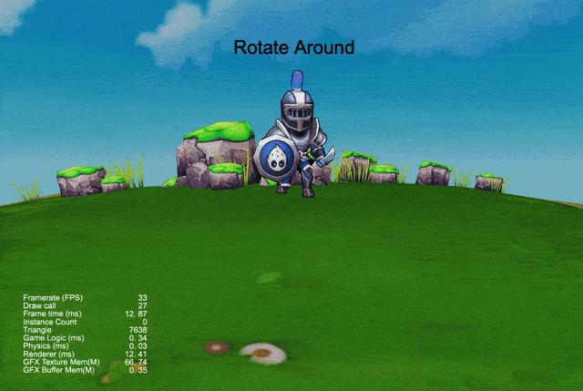

## CocosCreatorDemos
#### Write by yeshao2069.
#### CocosCreatorDemos provides some user's needs DEMOs, hoping to provide users with some inspiration.

#### Cocos Creator V3.0.x
&nbsp;

| 编号 | 类别 | 项目 | 演示图 |
| :---: | :---: |:---: |:---: |
| 1.1 | 2D | [双人分屏](https://gitee.com/yeshao2069/CocosCreatorDemos/tree/v3.0.x/demo/Creator3.0.0_2D_DualSplitScreen)  | 

 |
| 1.2 | 2D | [场景小地图](https://gitee.com/yeshao2069/CocosCreatorDemos/tree/v3.0.x/2DDemo/SceneMiniMap)  | 

 |
| 1.3 | 2D | [3D模型显示在UI中(UIMeshRenderer)](https://gitee.com/yeshao2069/CocosCreatorDemos/tree/v3.0.x/demo/Creator3.0.0_UIMeshRenderer)  | 

 |
| 1.4 | 2D | [骨骼动画显示在UI中(UIMeshRenderer)](https://gitee.com/yeshao2069/CocosCreatorDemos/tree/v3.0.x/demo/Creator3.0.0_UIMeshRenderer_SkeletalAnim) | 

 |
| 1.5 | 2D | [3D模型显示在UI中(RenderTexture)](https://gitee.com/yeshao2069/CocosCreatorDemos/tree/v3.0.x/demo/Creator3.0.0_RenderTexture)  | 

 |
| 1.6 | 2D | [骨骼动画显示在UI中(RenderTexture)](https://gitee.com/yeshao2069/CocosCreatorDemos/tree/v3.0.x/demo/Creator3.0.0_RenderTexture_SkeletalAnim)  | 

 |
| 1.7 | 2D | [2D 围绕物体旋转一周](https://gitee.com/yeshao2069/CocosCreatorDemos/tree/v3.0.x/demo/Creator3.0.0_2D_CameraRotateAround)  | 

 |
| 1.8 | 2D | [无限视差滚动背景](https://gitee.com/yeshao2069/CocosCreatorDemos/tree/v3.0.x/2DDemo/ScrollingBackground)  | 

 |
| 1.9 | 2D | [物体移动残影](https://gitee.com/yeshao2069/CocosCreatorDemos/tree/v3.0.x/demo/Creator3.0.0_2D_ObjectMovingShadow)  | 

 |
| 1.10 | 2D | [物体移动残影(spine)](https://gitee.com/yeshao2069/CocosCreatorDemos/tree/v3.0.x/demo/Creator3.0.0_2D_ObjectMovingShadow_Spine) | 

 |
| 1.11 | 2D | [放大镜](https://gitee.com/yeshao2069/CocosCreatorDemos/tree/v3.0.x/demo/Creator3.0.0_2D_Magnifier)  | 

 |
| 1.12 | 2D | [刮刮卡](https://gitee.com/yeshao2069/CocosCreatorDemos/tree/v3.0.x/demo/Creator3.0.0_2D_ScratchCard)  | 

 |
| 1.13 | 2D | [金币落袋](https://gitee.com/yeshao2069/CocosCreatorDemos/tree/v3.0.x/demo/Creator3.0.0_2D_CoinFlyToWallet)  | 

 |
| 1.14 | 2D | [打印机文字](https://gitee.com/yeshao2069/CocosCreatorDemos/tree/v3.0.x/demo/Creator3.0.0_2D_PrinterWord)  | 
 
 |
| 1.15 | 2D | [物体追踪](https://gitee.com/yeshao2069/CocosCreatorDemos/tree/v3.0.x/demo/Creator3.0.0_2D_BulletFollow)  | 

 |
| 1.16 | 2D | [虚拟摇杆](https://gitee.com/yeshao2069/CocosCreatorDemos/tree/v3.0.x/demo/Creator3.0.0_2D_VirtualJoyStick)  | 

 |
| 1.17 | 2D | [屏幕点击震动](https://gitee.com/yeshao2069/CocosCreatorDemos/tree/v3.0.x/demo/Creator3.0.0_2D_ScreenVibrating)  | 

 |
| 1.18 | 2D | [折纸](https://gitee.com/yeshao2069/CocosCreatorDemos/tree/v3.0.x/demo/Creator3.0.0_2D_Origami)  | 

 |
| 1.19 | 2D | [KTV歌词](https://gitee.com/yeshao2069/CocosCreatorDemos/tree/v3.0.x/demo/Creator3.0.0_2D_KTVLabel)  | 

 |
| 1.20 | 2D | [循环旋转菜单](https://gitee.com/yeshao2069/CocosCreatorDemos/tree/v3.0.x/demo/Creator3.0.0_2D_CircularMenu)  | 

 |
| 1.21 | 2D | [无限循环的翻页组件](https://gitee.com/yeshao2069/CocosCreatorDemos/tree/v3.0.x/demo/Creator3.0.0_2D_CircleScrollview)  | 

 |
| 1.22 | 2D | [可视化算法](https://gitee.com/yeshao2069/CocosCreatorDemos/tree/v3.0.x/demo/Creator3.0.0_2D_VisualizationAlgorithm) | 

 |
| 2.1 | 3D | [3D 围绕物体旋转一周(摄像机)](https://gitee.com/yeshao2069/CocosCreatorDemos/tree/v3.0.x/demo/Creator3.0.0_3D_CameraRotateAround)  | 

 |
| 2.2 | 3D | [3D 围绕物体旋转一周(四元数)](https://gitee.com/yeshao2069/CocosCreatorDemos/tree/v3.0.x/demo/Creator3.0.0_3D_CameraRotateAround_Quat)  | 

 |
| 2.3 | 3D | [3D 围绕物体旋转一周(自转)](https://gitee.com/yeshao2069/CocosCreatorDemos/tree/v3.0.x/demo/Creator3.0.0_3D_SelfRotateAround)  | 

 |
| 2.4 | 3D | [自定义骨骼动画播放](https://gitee.com/yeshao2069/CocosCreatorDemos/tree/v3.0.x/demo/Creator3.0.0_3D_CustomizePlaySkeletalAnim)  | 

 |
| 2.5 | 3D | [模型换肤](https://gitee.com/yeshao2069/CocosCreatorDemos/tree/v3.0.x/demo/Creator3.0.0_3D_ModelDressup)  | 

 |
| 2.6 | 3D | [第一人称视角](https://gitee.com/yeshao2069/CocosCreatorDemos/tree/v3.0.x/demo/Creator3.0.0_3D_FirstPersonPerspective)  | 

 |
| 2.7 | 3D | [3D文本](https://gitee.com/yeshao2069/CocosCreatorDemos/tree/v3.0.x/demo/Creator3.0.0_3D_Model3DText) |

 |
| 2.8 | 3D | [第一人称射击](https://gitee.com/yeshao2069/CocosCreatorDemos/tree/v3.0.x/demo/Creator3.0.0_3D_FirstPersonShooting)  | 

 |
| 2.9 | 3D | [点击旋转](https://gitee.com/yeshao2069/CocosCreatorDemos/tree/v3.0.x/demo/Creator3.0.0_3D_TouchAround)  | 

 |

### Mark
Cocos Creator Demos 3.0.x 版本列举效果 31 种，会同步更新到 [Cocos Creator Demos 3.4.x](https://gitee.com/yeshao2069/CocosCreatorDemos/tree/v3.4.x) 版本，后续 Cocos Creator Demos 3.0.x 将不会同步新的效果，请移步到 3.4.x 版本查看最新效果。