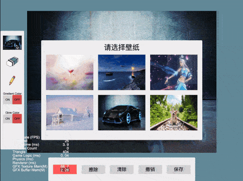
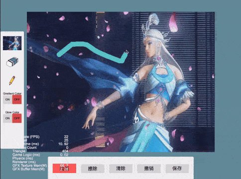
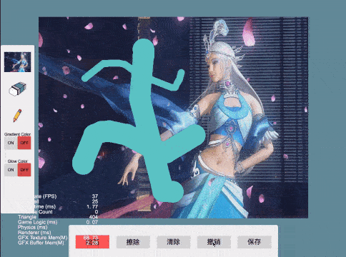
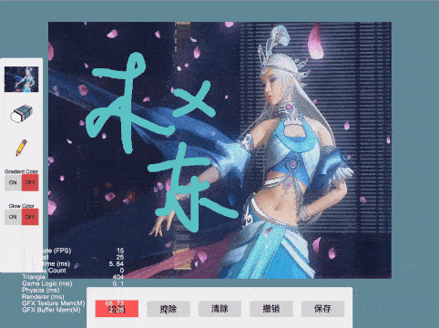
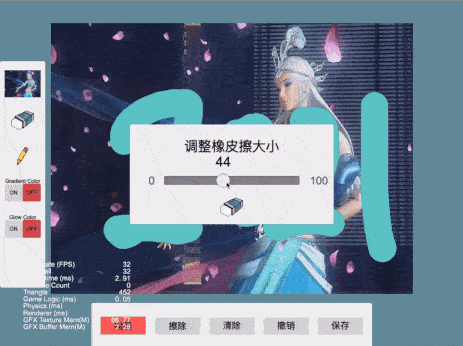
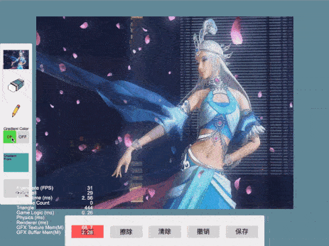

### Introduction
基于 CocosCreator 3.6.0 版本创建的 **画板** 工程

### Preview

### 功能支持
- 绘画
- 橡皮擦
- 清屏(清除所有操作)
- 回退(撤销当前操作)
- 画笔大小修改
- 橡皮擦大小修改
- 画布替换
- 截图并保存截图(Web)
- 渐变色画笔

### Related Links
https://gitee.com/skyxu123/drawing-board