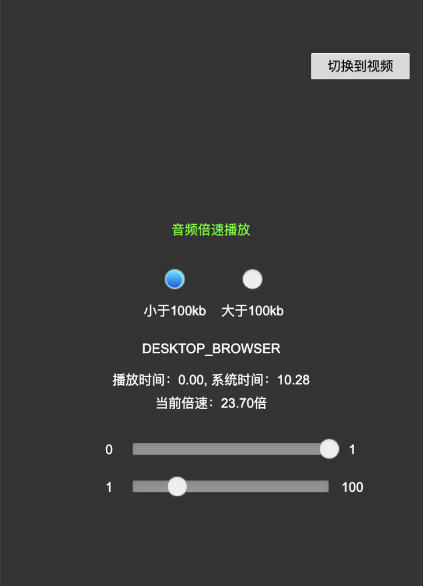

### Introduction
**Media Playback Rate** project created based on CocosCreator version 3.6.0

### Preview
Audio Playback Rate    

Vedio Playback Rate    

### Mark
- This solution is a custom engine that is not yet functional, so a custom engine is required.
- Extract the support-audio-and-video-speed-play-change.zip file from the support section of the project and split the folder into engine and engine/native (formerly engine-native, engine and engine-native were merged into one engine from 3.6 .0 onwards, engine-native has changed to engine/native). You will need to synchronise the modified files from the engine to the engine to complete the customisation. A detailed list of the modified files can be found in the `Change File List`.
- Since native (iOS, Android) and web support for audio and video multiplier playback varies, the actual playback will be platform and device specific.

### Change File List
engine/@types/jsb.d.ts    
engine/@types/pal/audio.d.ts    
engine/cocos/audio/audio-clip.ts       
engine/cocos/audio/audio-source.ts    
engine/extensions/videoplayer/CCVideoPlayer.js    
engine/pal/audio/native/player.ts    
engine/pal/audio/web/player-dom.ts    
engine/pal/audio/web/player-web.ts    
engine/pal/audio/web/player.ts    
engine/platforms/native/engine/jsb-videoplayer.js    
engine/native/cocos/audio/android/AudioEngine-inl.cpp    
engine/native/cocos/audio/android/AudioEngine-inl.h    
engine/native/cocos/audio/android/AudioMixerController.cpp    
engine/native/cocos/audio/android/AudioPlayerProvider.cpp    
engine/native/cocos/audio/android/AudioPlayerProvider.h     
engine/native/cocos/audio/android/IAudioPlayer.h    
engine/native/cocos/audio/android/PcmAudioPlayer.cpp    
engine/native/cocos/audio/android/PcmAudioPlayer.h    
engine/native/cocos/audio/android/PcmAudioService.cpp    
engine/native/cocos/audio/android/PcmAudioService.h    
engine/native/cocos/audio/android/Track.cpp    
engine/native/cocos/audio/android/Track.h    
engine/native/cocos/audio/android/UrlAudioPlayer.cpp    
engine/native/cocos/audio/android/UrlAudioPlayer.h    
engine/native/cocos/audio/apple/AudioEngine-inl.mm    
engine/native/cocos/audio/apple/AudioEngine-inl.h    
engine/native/cocos/audio/apple/AudioPlayer.mm    
engine/native/cocos/audio/apple/AudioPlayer.h    
engine/native/cocos/audio/AudioEngine.cpp    
engine/native/cocos/audio/include/AudioEngine.h    
engine/native/cocos/audio/oalsoft/AudioEngine-soft.cpp    
engine/native/cocos/bindings/auto/jsb_audio_auto.cpp    
engine/native/cocos/bindings/auto/jsb_audio_auto.h    
engine/native/cocos/bindings/auto/jsb_video_auto.cpp    
engine/native/cocos/bindings/auto/jsb_video_auto.h    
engine/native/cocos/platform/android/java/src/com/cocos/lib/CocosVideoHelper.java    
engine/native/cocos/platform/android/java/src/com/cocos/lib/CocosVideoView.java    
engine/native/cocos/ui/videoplayer/VideoPlayer-ios.mm    
engine/native/cocos/ui/videoplayer/VideoPlayer-java.cpp    
engine/native/cocos/ui/videoplayer/VideoPlayer.h    