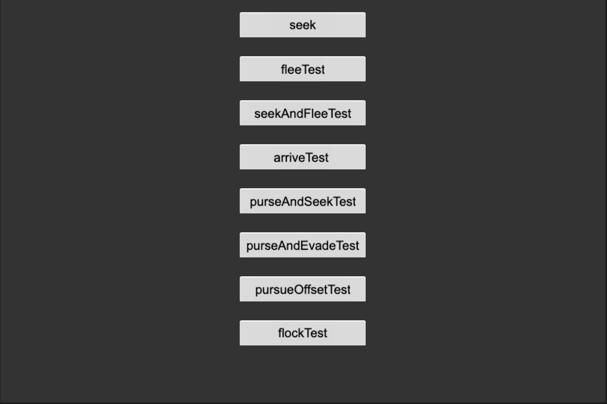
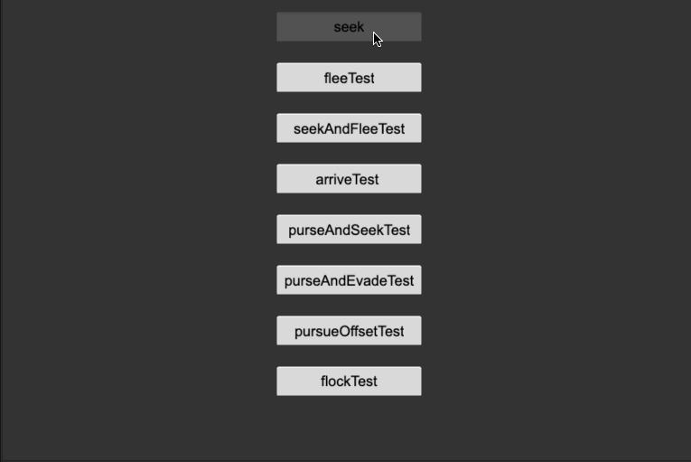

### Introduction
**Steering Behavior** project created based on CocosCreator version 3.7.0

### Preview

- seek    

- flee    

- seek and flee    

- arrive    

- pursue and seek    

- pursue and evade    

- pursue offset    

- flock    

### Related Links
https://github.com/baiyuwubing    
https://gitee.com/lamyoung    
https://space.bilibili.com/1756070/video    
https://store.cocos.com/app/detail/2893    
https://mp.weixin.qq.com/s/TOAfkeNBDb6NdOqRqzJhwQ