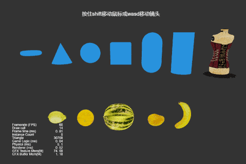

### Introduction
**Model Mesh Cutter** project created based on CocosCreator version 3.7.0

### Preview

### Caution
- Currently only models with builtin-unlit materials are supported for cutting.
- The engine module requires a Bullet-based physics engine.
- Setting CullMode to None for materials will somewhat improve the broken mesh through-mold situation, but performance will be degraded.
- There is no cut function for rotated model nodes, so you need to make sure that the model is not rotated.
- the performance of the current scheme is not optimal.
- The default detection accuracy of the current solution is 1/256 between two points, and too small fragments cannot be cut at this accuracy. The accuracy can be improved by increasing the raycastCount, but the performance will be degraded.
- Not all model nodes will not be cut through the mold, this is related to the original mesh of the model, the exact reason is not clear.
- the cut meshCollider fragments are currently unable to physically collide.

TODO.
- Support for rotated model nodes *P0*
- Find out the cause of cut-through and fix it *P1*.
- Solve the problem that cut meshCollider fragments cannot physically collide with each other *P1*
- Improve performance *P2*
- Improve the accuracy of detection *P2*

### Related Links
https://github.com/hugoscurti/mesh-cutter    
[sketchfab.com](https://sketchfab.com/search?features=downloadable&licenses=322a749bcfa841b29dff1e8a1bb74b0b&licenses=b9ddc40b93e34cdca1fc152f39b9f375&licenses=72360ff1740d419791934298b8b6d270&licenses=bbfe3f7dbcdd4122b966b85b9786a989&licenses=2628dbe5140a4e9592126c8df566c0b7&licenses=34b725081a6a4184957efaec2cb84ed3&licenses=7c23a1ba438d4306920229c12afcb5f9&licenses=783b685da9bf457d81e829fa283f3567&licenses=5b54cf13b1a4422ca439696eb152070d&q=tag%3Afruit&sort_by=-likeCount&type=models)