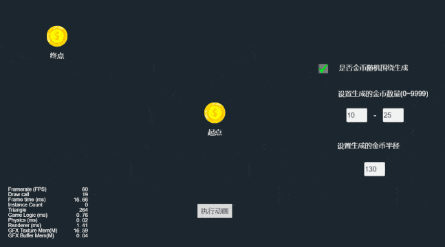

### 简介
基于 CocosCreator 3.0.0 版本创建的 **金币落袋** 工程。

### 效果预览

### 相关链接
https://github.com/ifengzp/cocos-awesome/tree/master/assets/Scene/Coin_fly_to_wallet

### 实现思路
1. 将围绕起点的圆分成N等分，求出每个等分的夹角。确定圆的半径R，以及圆心的坐标A，可以求出围绕起点位置的每个金币的位置。
2. 利用三角函数 x0 = R * Cosα，y0 = R * Sinα，算出位置 x0,y0