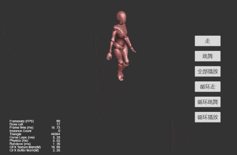
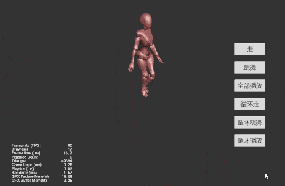
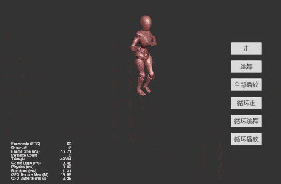
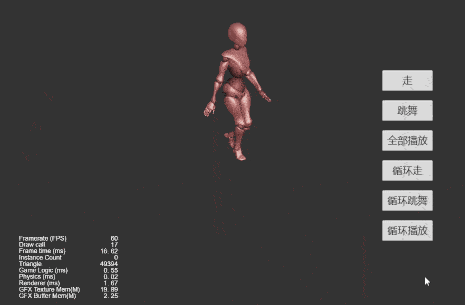

## Cocos Creator Demos

### 简介
基于 CocosCreator 3.0.0 版本创建的 **自定义骨骼动画播放** 工程。

### 效果预览

### 实现思路
使用骨骼动画的 SkeletalAnimationState，设置骨骼动画的开始播放时间(使用 setTime ), 然后在每一帧 update 判断当前播放的骨骼动画的 time 是否达到设定值